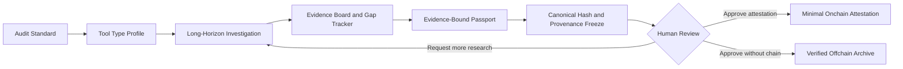
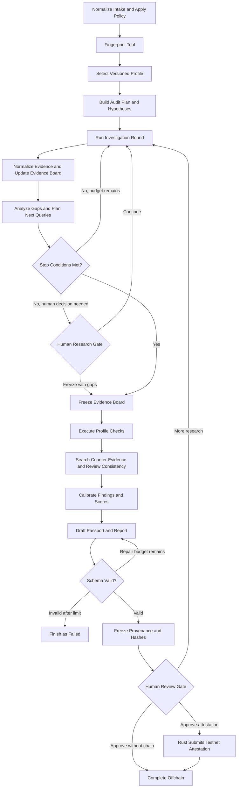

# AlethOS ToolPassport 项目说明

## 1. 项目定位

AlethOS ToolPassport 是面向 AI Tool 的标准驱动、证据绑定长程审计与证明模块。系统先定义统一的审计标准、工具类型 Profile、检查项、评分规则和证据要求，再由长程 Agent 围绕具体工具执行多轮调研、假设验证、证据映射、缺口分析、反证检查和评分校准，最终生成可复查的 Tool Passport。

本项目不声称证明审计结论“绝对真实”。它提供的是一组可验证保证：报告中的判断能够回到证据；审计步骤和关键决策能够复查；冻结后的产物和过程摘要不能被静默修改；链上登记能够证明某个 Hash 由某个地址在某个时间提交。网页、源码或模型判断本身是否真实，仍需要读者结合来源质量和审计范围判断。

英文定位：

> AlethOS ToolPassport is a long-horizon, standard-driven audit and
> attestation module for AI Tools. It produces evidence-bound,
> provenance-backed, hash-stable audit records without claiming absolute
> truth.

ToolPassport 是未来 AlethOS 平台可复用的工具治理模块，但本仓库不实现完整 AlethOS 控制平面，也不让 Codex 成为产品运行时信任组件。

## 2. 产品方法

AI Tool 的宣传声明、实际接口、权限边界和长期可用性经常分散在官网、文档、代码仓库、示例和运行材料中。一次性的自由文本评测很难说明 Agent 查了什么、遗漏了什么、为什么继续调研、为何给出某个评分，以及报告生成后是否被修改。

ToolPassport 使用固定审计标准约束 Agent，而不是让模型自由定义“好工具”的含义。总体标准定义七个审计维度、通用检查项、证据质量要求和评分边界；工具类型 Profile 再选择适用于 MCP Server、Agent Framework、CLI/API Tool 等对象的具体检查路线。Agent 的职责是调查和映射证据，Rust Trust Core 的职责是持久化、验证结构、执行确定性计算、冻结产物和处理链上提交。

## 3. 要解决的问题

ToolPassport 帮助用户判断一个 AI Tool 真正具备哪些能力、接口是否稳定、自动化和状态恢复能力是否充分、会接触哪些敏感权限、数据能否迁移，以及现有证据能否支撑长期接入决策。

系统尤其关注长程任务中的过程问题。Agent 不能只“多找一些资料”，而要持续维护待验证假设、Evidence Board 和 Gap Tracker；每轮调研都必须说明目标、来源、结果与下一步；高风险权限必须经过反证检查；证据不足时必须降分或标记未知，而不是补写无来源结论。

## 4. 审计标准与 Tool Type Profile

### 统一审计标准

统一标准预先定义审计维度、检查项语义、证据要求、风险等级、评分规则、停止条件和输出 schema。标准及其版本属于审计输入，审计运行期间不得由 Agent 静默修改。

七个审计维度保持稳定：

| 维度 | 核心问题 |
| --- | --- |
| Capability Clarity | 能力、用途、限制和不适用场景是否有证据支持 |
| Interface Openness | API、CLI、SDK、MCP、schema 和集成文档是否明确 |
| Automation Readiness | 是否支持稳定输入输出、无界面运行、日志、错误处理和恢复 |
| Data Portability | 数据、配置和工作流是否可导出，是否存在平台锁定 |
| Permission Risk | 文件、Shell、网络、密钥、钱包、数据库和付费 API 权限是否受控 |
| Evidence Quality | 来源是否可靠、可定位、可复查，并覆盖关键结论和反证 |
| Ecosystem Fit | 是否可组合、可替换、可维护，并适合 Agent 长期工作流 |

每个维度由预定义 checks 构成。Agent 输出 check 的证据化判断，Rust 按版本化规则聚合维度分数和总分。缺失证据不会被视为通过，高风险检查也不能被低风险项的高分掩盖。

### Tool Type Profile

不同工具共享总体标准，但不应走完全相同的审计路线。MVP 计划支持三个 Profile：

| Profile | 重点审计内容 |
| --- | --- |
| MCP Server | Tool schema、文件与 Shell 权限、密钥暴露、网络范围和调用边界 |
| Agent Framework | 工具调用模型、状态恢复、持久化、人工闸门、插件与权限隔离 |
| CLI/API Tool | 参数或 API 契约、鉴权、结构化输入输出、错误处理、导出和费用风险 |

无法可靠分类的对象进入 `generic` 降级 Profile。降级运行必须显式记录范围限制，不允许 Agent 临时发明未版本化的检查项。

## 5. 长程审计过程

长程审计不是一次性的“调研后生成报告”，而是一个有预算、有状态、有回路、有人工闸门的调查任务。

每一步都有明确的输入、输出、分支条件、重试上限和权限边界。系统保存的是可复查的计划、证据、缺口、结构化判断和决策摘要，不保存或宣称验证模型的私有思维过程。

调查回路至少回答四个问题：

1. 当前最重要的未决 claim 或 check 是什么；
2. 下一次查询将寻找什么类型的支持或反证；
3. 新证据如何改变 Evidence Board、Gap Tracker 或 Risk Register；
4. 为什么继续、停止或请求人工决策。

调研必须在预算或停止条件内结束。关键检查已覆盖、高风险权限已完成反证检查、剩余缺口低于阈值时可以正常冻结；达到最大轮数、来源不可访问或用户要求提前结束时，必须生成带明确缺口的有限结论，不能伪装成完整审计。

## 6. 核心产物与可验证保证

### Evidence Manifest 与 Evidence Board

Evidence Manifest 保存来源、获取时间、内容 Hash、可复查摘录、快照或源码 revision 等元数据。Evidence Board 将每个 claim 和 check 绑定到支持证据、反证、状态和置信度。允许的 claim 状态包括 `supported`、`partially_supported`、`unsupported`、`contradicted` 和 `not_checked`。

Passport 中的能力、风险和评分理由必须能回到 Evidence Board。搜索摘要不能作为最终证据；不同来源冲突时保留双方，并在报告中标记冲突。

### Audit Provenance

Audit Run Log 记录节点、输入输出摘要、版本、工具调用、错误、重试、分支理由和人工决定。MVP 已将数据库事件设计为 append-only；目标设计还会由 Rust 为冻结边界前的事件建立顺序明确的哈希链，并将最终链头作为 `auditLogHash`。

### Immutable Passport 与 Attestation Receipt

Passport 在 schema 校验后使用规范化 JSON 和 SHA-256 计算 `passportHash`。一旦冻结，不得把交易状态或回执写回同一 Passport。链上回执属于独立的 Attestation Receipt；对已冻结内容的修改必须创建新版本和新 Hash。

链上最小摘要包含：

- `toolId`
- `toolType`
- `passportHash`
- `auditLogHash`
- `auditor`
- `timestamp`

链上记录证明 Hash、提交地址和时间，不证明报告语义绝对正确，也不证明来源内容本身真实。

## 7. MVP 用户流程

用户从 Dashboard 创建审计任务并提供工具名称、URL、GitHub 或本地材料。系统规范化输入并执行策略检查，识别工具类型，选择版本化 Profile，然后生成待验证假设和调查计划。

Agent 在受控只读工具范围内执行多轮调研，持续更新 Evidence Board、Gap Tracker 和 Risk Register。证据覆盖满足停止条件或达到研究预算后，系统冻结 Evidence Board，按 Profile 执行 checks，再由 Skeptic Review 主动查找反证、遗漏风险和过度声明。

GLM-5.1 生成的结构化 findings、Passport 草稿和报告必须通过 schema 验证。Rust Trust Core 负责确定性评分、持久化、规范化、最终 Hash 和审批绑定。用户可以要求继续调研、批准仅链下归档，或明确批准测试网 attestation。任何链上写入都必须经过人工确认。

## 8. MVP 范围与成功标准

MVP 的重点是展示一个真实可控的长程审计任务，而不是覆盖所有工具类型或实现自由多 Agent 协作。固定角色可以用于规划、调研、证据分析和怀疑性审查，但角色必须由主图编排，不能自行扩展权限或绕过 Rust 后端。

MVP 必须最终展示：Profile 选择；至少两轮有明确原因的调研；claim/check 与 evidence 的绑定；Gap Tracker 触发的分支；一次反证或降分决定；可恢复的运行记录；人工闸门；稳定 Hash；以及经人工批准的测试网摘要登记。

完成标准包括：

- Dashboard 能创建、观察和恢复一个完整 mock 审计；
- 每个高权重 check 有结果、证据或明确缺口；
- Passport JSON 可通过版本化 schema 校验；
- Run Log 可复查节点、分支、错误、重试和人工决定；
- 相同冻结产物可生成相同 Hash；
- Attestation Receipt 与不可变 Passport 分离；
- 未经人工批准不会签名、部署或写链；
- 至少两份示例审计可用于 Demo；
- 新环境可按 README 复现 mock 路径。

明确不做：完整 Marketplace、账号系统、自由多 Agent 网络、大规模爬虫、自动执行未知项目、主网写入、无人确认的钱包签名，以及把 Codex 作为运行时审计方。

## 9. 当前实现边界

截至 2026-06-12，仓库已完成 monorepo scaffold、最小 Registry 合约、基础 schema、Rust Run API 和 SQLite append-only Run Event。Rust 会在创建 Run 时原子追加首个 `run_created` 事件，并将经过验证的 node、approval 和终止状态事件投影到 Run 摘要；数据库 trigger 会拒绝事件更新或删除。

长程审计图、事件哈希链、Evidence Manifest、Evidence Board、check-level 评分、Artifact、SSE、持久化审批记录、Passport Hash 和链上提交仍属于计划能力。现有 orchestrator 只包含 `clarify_goal` 和 `plan_audit` 两个 mock 节点，Dashboard 也只展示开发 workspace 状态。详细冲突和迁移顺序记录在 `docs/technical-design.md`，文档不得把这些计划能力描述为已经实现。

## 10. 设计参考与后续方向

本项目借鉴而不宣称兼容以下体系：

- [OpenSSF Scorecard](https://scorecard.dev/)：以版本化 checks 形成可解释评估；
- [SLSA Provenance](https://slsa.dev/spec/v1.2/provenance)：描述产物从输入和过程生成的可验证来源；
- [in-toto Attestation Framework](https://github.com/in-toto/attestation)：表达步骤级可验证声明；
- [RFC 8785 JCS](https://www.rfc-editor.org/rfc/rfc8785)：生成适合稳定哈希的规范化 JSON；
- [Sigstore Rekor](https://docs.sigstore.dev/logging/overview/)：参考 append-only 透明日志与可验证登记；
- [NIST OSCAL](https://pages.nist.gov/OSCAL/)：参考机器可读 controls、assessment plan 和 results。

MVP 后可增加更多 Profile、团队自定义准入策略、多审计方聚合、签名 provenance、透明日志 proof、工具依赖图谱、IPFS 产物存储，以及 EAS 或 Verifiable Credentials 兼容输出。
