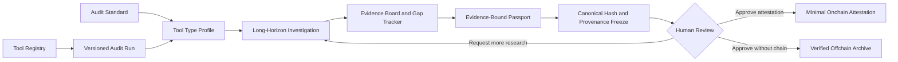
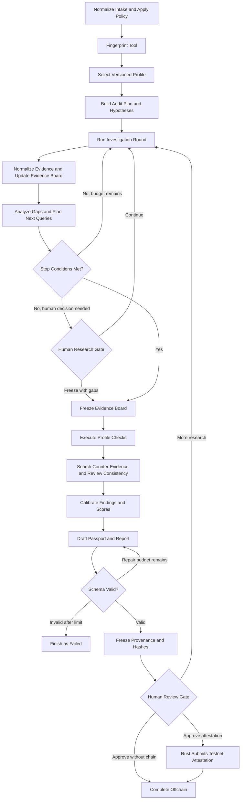

# AlethOS ToolPassport 项目说明

## 1. 项目定位

AlethOS ToolPassport 是围绕 AI Tool Registry 建立的标准驱动、证据绑定长程审计索引与证明模块。系统先为工具建立稳定身份和分类，再定义统一的审计标准、工具类型 Profile、检查项、评分规则和证据要求，由长程 Agent 围绕具体工具版本执行多轮调研、假设验证、证据映射、缺口分析、反证检查和评分校准，最终生成可复查的 Tool Passport。

本项目不声称证明审计结论“绝对真实”。它提供的是一组可验证保证：报告中的判断能够回到证据；审计步骤和关键决策能够复查；冻结后的产物和过程摘要不能被静默修改；链上登记能够证明某个 Hash 由某个地址在某个时间提交。网页、源码或模型判断本身是否真实，仍需要读者结合来源质量和审计范围判断。

英文定位：

> AlethOS ToolPassport is a structured audit index for AI Tools. It groups
> evidence-bound, provenance-backed, hash-stable audit records around stable
> tool identities without claiming absolute truth.

ToolPassport 是未来 AlethOS 平台可复用的工具治理模块，但本仓库不实现完整 AlethOS 控制平面，也不让 Codex 成为产品运行时信任组件。

## 2. 产品方法

AI Tool 的宣传声明、实际接口、权限边界和长期可用性经常分散在官网、文档、代码仓库、示例和运行材料中。一次性的自由文本评测很难说明 Agent 查了什么、遗漏了什么、为什么继续调研、为何给出某个评分，以及报告生成后是否被修改。缺少稳定身份层时，同一工具还会以名称、仓库 URL、产品名和别名重复出现，无法形成连续的审计历史。

ToolPassport 使用固定审计标准约束 Agent，而不是让模型自由定义“好工具”的含义。总体标准定义七个审计维度、通用检查项、证据质量要求和评分边界；工具类型 Profile 再选择适用于 MCP Server、Agent Framework、CLI/API Tool 等对象的具体检查路线。Agent 的职责是调查和映射证据，Rust Trust Core 的职责是持久化、验证结构、执行确定性计算、冻结产物和处理链上提交。

系统不把每份报告平铺成孤立记录，而是按以下层级组织：

```text
Tool Registry
└── Tool
    └── Audit Runs
        └── Passports
            ├── Evidence / Scores
            └── Attestations
```

`Tool` 回答“被审计对象是谁”，`Audit Run` 回答“针对哪个版本、按什么标准执行了哪次审计”，`Passport` 回答“这次审计得出了什么结论”，Evidence 与 Attestation 分别回答“依据是什么”和“哪些冻结 Hash 被登记”。同一工具的首次审计、版本复审、修复后复审和专项审计都聚合到同一个 `tool_id` 下。



## 3. 要解决的问题

ToolPassport 帮助用户判断一个 AI Tool 真正具备哪些能力、接口是否稳定、自动化和状态恢复能力是否充分、会接触哪些敏感权限、数据能否迁移，以及现有证据能否支撑长期接入决策。

系统尤其关注长程任务中的过程问题。Agent 不能只“多找一些资料”，而要持续维护待验证假设、Evidence Board 和 Gap Tracker；每轮调研都必须说明目标、来源、结果与下一步；高风险权限必须经过反证检查；证据不足时必须降分或标记未知，而不是补写无来源结论。

## 4. Tool Registry、分类与审计 Profile

### Tool Registry 与 Tool Type Taxonomy

Tool Registry 是审计索引的上层入口。每个工具拥有 Rust 分配和维护的稳定 `tool_id`、展示名称、规范 URL、来源标识、别名和工具类型。MVP 至少支持基于规范 GitHub 仓库或规范 URL 解析工具身份；无法安全归并、存在 fork 冲突或身份含糊时，系统必须请求人工确认，不能仅按相似名称自动合并。

工具类型决定应使用的 Audit Profile。MVP 的可执行分类保持为 `agent_framework`、`mcp_server`、`cli_api_tool` 和受限的 `generic` fallback。更广泛的 API/SDK Service、Workflow Platform、AI Application 等分类可以在后续通过新增版本化 Profile 扩展，不要求 MVP 一次覆盖。

Tool 身份与某次审计目标必须分离。`tool_id` 在首次可信来源创建时固定，并在多次审计之间保持稳定；版本、commit、release、审计范围、标准和 Profile 绑定在 `run_id` 上。来源迁移只能在人工批准后追加 external identifier，不能改写历史 `tool_id`。别名仅用于展示和人工发现，不能触发自动归并或替代规范 ID。

Stage 2.1 已定义离线三态身份解析契约：所有强标识唯一指向同一已有 Tool 时返回 `resolved`；恰好一个有效且未占用的强标识时返回 `create_candidate`；仅名称匹配、零强标识、多个不同强标识、fork、来源迁移和冲突标识均返回 `needs_review`。参考规范化器不联网、不跟随重定向，也不自动确认仓库迁移。

### 统一审计标准

统一标准预先定义审计维度、检查项语义、证据要求、风险等级、评分规则、停止条件和输出 schema。标准及其版本属于审计输入，审计运行期间不得由 Agent 静默修改。用户可以在标准框架内提供自然语言审计指令（`audit_directives`），引导调查优先级和假设方向，但不能跳过强制检查、创建非版本化检查项或覆盖 Profile 选择。

七个审计维度保持稳定：

| 维度 | 核心问题 |
| --- | --- |
| Capability Clarity | 能力、用途、限制和不适用场景是否有证据支持 |
| Interface Openness | API、CLI、SDK、MCP、schema 和集成文档是否明确 |
| Automation Readiness | 是否支持稳定输入输出、无界面运行、日志、错误处理和恢复 |
| Data Portability | 数据、配置和工作流是否可导出，是否存在平台锁定 |
| Permission Risk | 文件、Shell、网络、密钥、钱包、数据库和付费 API 权限是否受控 |
| Evidence Quality | 来源是否可靠、可定位、可复查，并覆盖关键结论和反证 |
| Ecosystem Fit | 是否可组合、可替换、可维护，并适合 Agent 长期工作流 |

每个维度由预定义 checks 构成。Agent 输出 check 的证据化判断，Rust 按版本化规则聚合维度分数和总分。缺失证据不会被视为通过，高风险检查也不能被低风险项的高分掩盖。

### Tool Type Profile

不同工具共享总体标准，但不应走完全相同的审计路线。MVP 计划支持三个 Profile：

| Profile | 重点审计内容 |
| --- | --- |
| MCP Server | Tool schema、文件与 Shell 权限、密钥暴露、网络范围和调用边界 |
| Agent Framework | 工具调用模型、状态恢复、持久化、人工闸门、插件与权限隔离 |
| CLI/API Tool | 参数或 API 契约、鉴权、结构化输入输出、错误处理、导出和费用风险 |

无法可靠分类的对象进入 `generic` 降级 Profile。降级运行必须显式记录范围限制，不允许 Agent 临时发明未版本化的检查项。

## 5. 长程审计过程

长程审计不是一次性的”调研后生成报告”，而是一个有预算、有状态、有回路、有人工闸门的调查任务。用户可以通过可选的 `audit_directives` 在标准框架内用自然语言引导调查方向——例如指定重点维度、要求验证特定声明、提供使用场景上下文——系统据此调整调查优先级和假设生成，但不能跳过强制高风险检查或创建非版本化检查项。



每一步都有明确的输入、输出、分支条件、重试上限和权限边界。系统保存的是可复查的计划、证据、缺口、结构化判断和决策摘要，不保存或宣称验证模型的私有思维过程。

调查回路至少回答四个问题：

1. 当前最重要的未决 claim 或 check 是什么；
2. 下一次查询将寻找什么类型的支持或反证；
3. 新证据如何改变 Evidence Board、Gap Tracker 或 Risk Register；
4. 为什么继续、停止或请求人工决策。

调研必须在预算或停止条件内结束。关键检查已覆盖、高风险权限已完成反证检查、剩余缺口低于阈值时可以正常冻结；达到最大轮数、来源不可访问或用户要求提前结束时，必须生成带明确缺口的有限结论，不能伪装成完整审计。

## 6. 核心产物与可验证保证

### Evidence Manifest 与 Evidence Board

Evidence Manifest 保存来源、获取时间、内容 Hash、可复查摘录、快照或源码 revision 等元数据。Evidence Board 将每个 claim 和 check 绑定到支持证据、反证、状态和置信度。允许的 claim 状态包括 `supported`、`partially_supported`、`unsupported`、`contradicted` 和 `not_checked`。

Passport 中的能力、风险和评分理由必须能回到 Evidence Board。搜索摘要不能作为最终证据；不同来源冲突时保留双方，并在报告中标记冲突。

### Audit Provenance

Audit Run Log 记录节点、输入输出摘要、版本、工具调用、错误、重试、分支理由和人工决定。MVP 已将数据库事件设计为 append-only；目标设计还会由 Rust 为冻结边界前的事件建立顺序明确的哈希链，并将最终链头作为 `auditLogHash`。

### Immutable Passport 与 Attestation Receipt

Passport 在 schema 校验后使用规范化 JSON 和 SHA-256 计算 `passportHash`。一旦冻结，不得把交易状态或回执写回同一 Passport。链上回执属于独立的 Attestation Receipt；对已冻结内容的修改必须创建新版本和新 Hash。

链上最小摘要包含：

- `toolId`
- `runId`
- `toolType`
- `passportHash`
- `auditLogHash`
- `evidenceManifestHash`
- `auditor`
- `timestamp`

链上 `runId` 是 Rust 根据后端 Run UUID 生成的稳定 `bytes32` commitment，使记录可以按 `toolId -> runId -> passportHash` 关联。链上记录证明 Hash、提交地址和时间，不证明报告语义绝对正确，也不证明来源内容本身真实。开放合约也不能阻止任意地址提交任意 `toolId`，因此规范 Tool 身份、可信审计方筛选、别名、描述和依赖关系保留在链下 Registry，不复制到合约。

## 7. MVP 用户流程

用户从 Dashboard 选择已有 Tool 或提交工具名称、URL、GitHub 和本地材料，并可选提供自然语言审计指令。系统先解析或创建规范 Tool 身份，将新 Run 绑定到 `tool_id` 和目标版本，再执行策略检查、识别工具类型、选择版本化 Profile，并结合用户指令和标准约束生成待验证假设和调查计划。

Agent 在受控只读工具范围内执行多轮调研，持续更新 Evidence Board、Gap Tracker 和 Risk Register。证据覆盖满足停止条件或达到研究预算后，系统冻结 Evidence Board，按 Profile 执行 checks，再由 Skeptic Review 主动查找反证、遗漏风险和过度声明。

GLM-5.1 生成的结构化 findings、Passport 草稿和报告必须通过 schema 验证。Rust Trust Core 负责确定性评分、持久化、规范化、最终 Hash 和审批绑定。用户可以要求继续调研、批准仅链下归档，或明确批准测试网 attestation。任何链上写入都必须经过人工确认。

## 8. MVP 范围与成功标准

MVP 的重点是展示一个真实可控的长程审计任务，而不是覆盖所有工具类型或实现自由多 Agent 协作。固定角色可以用于规划、调研、证据分析和怀疑性审查，但角色必须由主图编排，不能自行扩展权限或绕过 Rust 后端。

MVP 必须最终展示：Profile 选择；至少两轮有明确原因的调研；claim/check 与 evidence 的绑定；Gap Tracker 触发的分支；一次反证或降分决定；可恢复的运行记录；人工闸门；稳定 Hash；经人工批准的测试网摘要登记；以及用户审计指令对调查优先级的可复查影响。

完成标准包括：

- Dashboard 能创建、观察和恢复一个完整 mock 审计；
- 每个 Run、Passport 和 Attestation 都能回到唯一 `tool_id`；
- 每个高权重 check 有结果、证据或明确缺口；
- Passport JSON 可通过版本化 schema 校验；
- Run Log 可复查节点、分支、错误、重试和人工决定；
- 相同冻结产物可生成相同 Hash；
- Attestation Receipt 与不可变 Passport 分离；
- 未经人工批准不会签名、部署或写链；
- 至少两份示例审计可用于 Demo；
- 新环境可按 README 复现 mock 路径。

明确不做：完整 Marketplace、账号系统、自由多 Agent 网络、Tool Graph 与依赖风险传播、大规模爬虫、自动执行未知项目、主网写入、无人确认的钱包签名，以及把 Codex 作为运行时审计方。

## 9. 当前实现边界

截至 2026-06-13，仓库已完成 monorepo scaffold、最小 Registry commitment 合约、
Stage 1 Standard/Profile catalog、Stage 2 Tool Identity 与 Run binding、Stage 3
离线 orchestrator 调查 mock、Stage 4 Evidence/Artifact Trust Core，以及 Stage 5
决策事件与事件哈希链。Stage 6 已先发布严格的 finding submission、Rust-owned check
results、冻结 Evidence Board/Manifest、Passport v0.2、Provenance 和独立
Attestation Receipt 共享契约，但 Rust 评分、冻结持久化和 API 尚未实现。Rust 已提供
Tool、Run、append-only Run Event、Evidence 和 Artifact API；Run 创建绑定规范
`tool_id` 并冻结 Tool 快照。Artifact 使用受限 multipart 上传，Evidence 使用严格的
规范化 JSON 契约；两者均由 Rust 分配 ID 与内部存储键、限制在配置的 Artifact
根目录下、对实际保存字节计算 SHA-256，并原子追加对应创建事件。用户文件名仅作为
展示元数据，不参与磁盘路径生成。

Dashboard 已从开发 scaffold 升级为只读 Trust Control Desk：通过 Rust 后端展示真实
健康状态、Run 和 Event，并提供双语切换、筛选、自动刷新和响应式布局。尚无权威
后端实现的评分、Findings、Evidence Board、commitment、执行图和 provenance 视图
均明确标记为 Preview；Dashboard 不计算评分或 Hash，也不提供审批或链上写入。
Stage 4 尚未把 orchestrator mock 接入 Evidence/Artifact API，也未提供 Artifact
内容读取接口；check-level 确定性评分、冻结 Passport、SSE、恢复、持久化审批记录和
测试网提交仍属于计划能力。详细迁移顺序记录在 `docs/technical-design.md`。

## 10. 设计参考与后续方向

本项目借鉴而不宣称兼容以下体系：

- [OpenSSF Scorecard](https://scorecard.dev/)：以版本化 checks 形成可解释评估；
- [SLSA Provenance](https://slsa.dev/spec/v1.2/provenance)：描述产物从输入和过程生成的可验证来源；
- [in-toto Attestation Framework](https://github.com/in-toto/attestation)：表达步骤级可验证声明；
- [RFC 8785 JCS](https://www.rfc-editor.org/rfc/rfc8785)：生成适合稳定哈希的规范化 JSON；
- [Sigstore Rekor](https://docs.sigstore.dev/logging/overview/)：参考 append-only 透明日志与可验证登记；
- [NIST OSCAL](https://pages.nist.gov/OSCAL/)：参考机器可读 controls、assessment plan 和 results。

### Tool Graph 与依赖网络

Tool Graph 是重点后续方向，但不属于本次 MVP。长期可在稳定 Tool Registry 上增加版本化关系边，例如 `depends_on`、`integrates_with`、`calls`、`requires_permission` 和 `used_by`，并让每条关系绑定来源、发现时间、适用版本和置信度。这样可以支持依赖风险传播、替代工具发现、权限路径分析和生态准入，而不是只保存一组互不相关的报告。

MVP 只为该方向保留兼容边界：稳定 `tool_id`、Run 级目标版本、Evidence 引用和可扩展 Artifact。MVP 不采集完整依赖树、不实现图数据库、不计算跨工具风险，也不因为发现依赖而自动扩大当前审计范围。

未来可参考 Package URL 规范化软件包身份，参考 SPDX 与 CycloneDX 表达依赖和 SBOM 关系，并结合更多 Profile、团队自定义准入策略、多审计方聚合、签名 provenance、透明日志 proof、IPFS 产物存储，以及 EAS 或 Verifiable Credentials 兼容输出。
