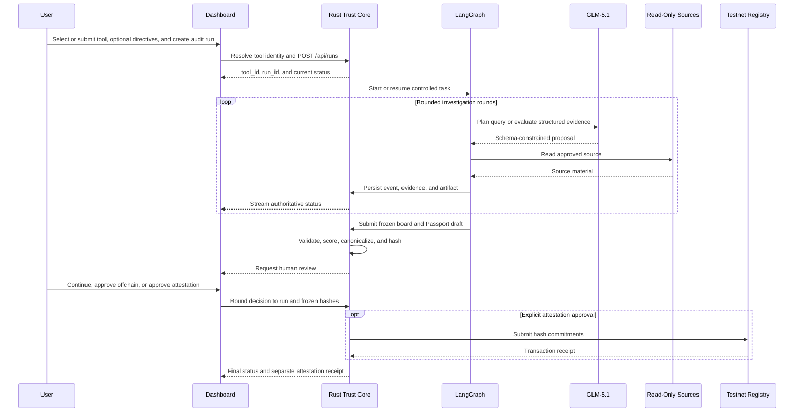
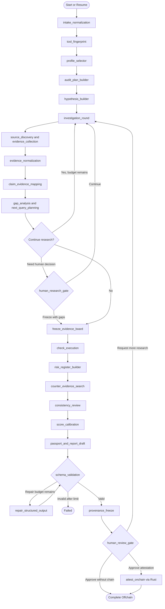
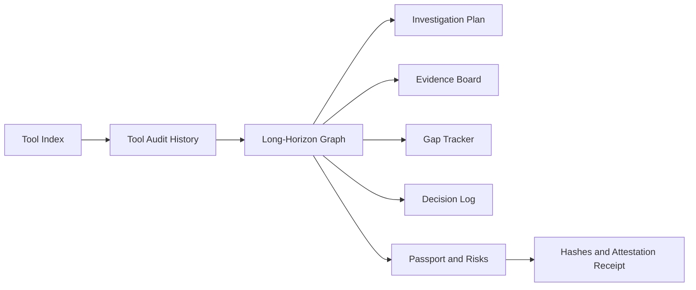

# AlethOS ToolPassport 技术设计

## 1. 文档状态与设计原则

本文同时描述当前实现基线和目标架构。为避免把计划能力误写成已经完成，使用以下状态：

| 标记 | 含义 |
| --- | --- |
| Implemented | 当前仓库已有实现和测试 |
| Partial | 已有基础实现，但尚未满足完整契约 |
| Target | 已确定的目标设计，仍需按迁移顺序实现 |
| Future | MVP 后再评估，不属于当前契约 |

截至 2026-06-13，机器可读权威包括共享运行时 v0.1 schema、Audit
Standard/Profile schema、历史 `0.2.0` 与评分绑定 `0.3.0` catalog、Tool Identity
v0.1 schema、Artifact v0.1 schema、
Evidence v0.2 create/stored schema，以及 Stage 6 的 Check Result submission/stored、
冻结 Evidence Board、Evidence Manifest、Passport v0.2、Provenance 和独立
Attestation Receipt 契约。Tool Registry 持久化/API、Run binding、Stage 3 离线调查
mock、Stage 4 Evidence/Artifact Trust Core 与 Stage 5 决策事件/哈希链已实现；
Stage 6 已完成共享契约和 Rust 确定性评分核心，冻结持久化和 API 仍属于目标设计。
在后端、orchestrator 和 Dashboard 完成协调迁移前，不得向现有 API 发送这些尚未
实现的 Stage 6 字段。

架构职责保持固定：

| 层 | 技术 | 唯一职责 |
| --- | --- | --- |
| Dashboard | Next.js、React、React Flow、TanStack Query | 展示后端状态并发起用户操作，不承载业务规则 |
| Trust Core | Rust、Axum、SQLx、SQLite、Alloy | API、持久化、append-only 事件、Artifact、确定性评分、最终 Hash、审批和链上写入 |
| Orchestrator | Python、LangGraph、Pydantic | 长程任务状态、节点调度、分支、预算、重试、恢复和人工等待 |
| Reasoning | GLM-5.1 | 在版本化标准内生成计划、查询、证据化判断、审查意见和报告草稿 |
| Research | 受控网页、GitHub 和用户材料读取器 | 只读发现和采集来源，不执行被审计项目 |
| Web3 | Solidity、Foundry | 保存最小 Hash commitment |
| Engineering | Codex | 开发期实现、测试和修复，不属于运行时信任链 |

Rust 是系统记录和确定性计算的唯一权威来源。LangGraph 不直接写数据库、计算最终 Hash 或提交交易；Dashboard 不直接调用 GLM、数据库或 RPC；GLM 输出必须 schema 校验后才能进入状态。任何签名、部署或链上写入都需要显式人工批准。

## 2. 信任声明与非目标

ToolPassport 的目标是可追溯、可复查、可验证和不可静默篡改，而不是证明报告语义绝对正确。

系统可以证明：

- 某个 Passport 与 Audit Log 在冻结后是否发生变化；
- 某个 claim、check、风险或评分理由引用了哪些证据；
- 审计使用了哪个标准、Profile、模型和工作流版本；
- 审计过程中发生了哪些节点、分支、重试和人工决定；
- 某个地址何时向 Registry 提交了指定 Hash。

系统不能单独证明：

- 来源网页、仓库声明或用户材料本身真实；
- GLM 的语义判断一定正确或完整；
- 未检查范围不存在风险；
- 链上提交地址代表某个现实主体，除非另有身份验证；
- 链上 Hash 对应的链下内容始终可获得。

报告和 Dashboard 必须展示这些边界。禁止使用“链上保证报告真实”之类表述。

## 3. Monorepo 与目标数据流

```text
.
├── AGENTS.md
├── README.md
├── .codex/work-guide.md
├── docs/
├── backend/
├── orchestrator/
├── dashboard/
├── contracts/
├── schemas/
├── examples/
├── scripts/
└── runs/
```

`runs/` 仅保存本地 Artifact，不是数据库替代。敏感材料、大体积快照和未授权内容默认不提交。跨模块共享类型以 `schemas/` 为机器可读权威；字段变更必须同时更新 schema、实现、测试和本文。

`scripts/check_schemas.sh` 使用 `schemas/requirements.lock` 中固定的 Python
`jsonschema` 实现，对所有 `*.schema.json` 强制执行 Draft 2020-12 元验证，再运行
catalog、Tool Identity 和聚焦契约测试。本地复用 `orchestrator/.venv`，不创建第二个
Python 虚拟环境；CI 在独立 schemas job 中安装同一锁定依赖。



目标进程模型仍由 Rust 启动受控 Python orchestrator 子进程，并通过 `RUN_ID` 与 `BACKEND_URL` 关联。后续可以替换为独立服务，但不得改变 Rust 权威边界。

### 3.1 核心实体与聚合边界

系统的根聚合不是 Passport，而是 Tool。权威层级为：

```text
Tool Registry
└── Tool
    └── Audit Run
        └── Passport
            ├── Evidence Manifest / Scores
            └── Attestation Receipt
```

Tool 保存跨审计稳定的身份；Audit Run 保存目标版本、审计范围、Standard、Profile 和执行状态；Passport 是某次 Run 的冻结结论；Evidence、Score 和 Attestation 必须能回到同一个 Run。MVP 不允许创建无法绑定到规范 `tool_id` 的最终 Passport 或 Attestation。

目标 Tool 记录至少包含：

```json
{
  "tool_id": "github:langchain-ai/langgraph",
  "name": "LangGraph",
  "tool_type": "agent_framework",
  "canonical_url": "https://github.com/langchain-ai/langgraph",
  "external_identifiers": [
    {
      "namespace": "github",
      "value": "langchain-ai/langgraph",
      "canonical_url": "https://github.com/langchain-ai/langgraph"
    }
  ],
  "aliases": ["LangGraph SDK"]
}
```

Stage 2.1 已实现 `tool.schema.json`、`tool-identity-intake.schema.json` 和
`tool-identity-resolution.schema.json`，以及无网络依赖的参考规范化器与版本化 fixtures。
当前 `tool_type` 严格绑定 `generic`、`agent_framework`、`mcp_server` 和
`cli_api_tool` 四个 Profile 类型。

`tool_id` 是后续由 Rust 维护的稳定、带命名空间标识。首次可信来源创建时，GitHub
仓库使用 `github:owner/repo`，一般 URL 使用 `url:host/path`。GitHub 仅接受仓库根
HTTPS URL，并归并 owner/repo 大小写、`.git` 和尾部斜线；issue、tree、blob、query
和 fragment 均进入人工确认。一般 URL 仅接受无凭证、无 query、无 fragment 的
HTTPS URL；host 转小写，移除 `:443` 和尾部斜线，并保留路径大小写。HTTP、非默认
端口、含糊 URL、重定向和来源迁移均不能自动确认。

身份解析只返回三种状态：所有强标识唯一指向同一已有 Tool 时为 `resolved`；恰好
一个有效且未占用的强标识时为 `create_candidate`；名称匹配、零强标识、多个不同
强标识、fork、来源迁移或冲突标识时为 `needs_review`。名称和 aliases 仅用于展示
与人工发现，不作为自动归并的强标识。`tool_id` 一旦创建就不得因来源迁移而改写；
批准迁移时只追加 external identifier。Tool 保存当前分类，Run 同时冻结审计时使用的
`tool_type` 与 Profile，避免后续重新分类改写历史。

目标 Audit Run 必须包含 `tool_id`、目标版本或 revision、审计目标、可选的用户审计指令、Standard/Profile 版本、范围、预算和状态。版本未知时必须显式记录 `unresolved`，不能把“最新版本”作为不可复查的目标值。

### 3.2 Tool Graph 后续边界

Tool Graph 是建立在稳定 Tool Registry 之上的 Future 能力，不属于 MVP。未来关系边可以包括 `depends_on`、`integrates_with`、`calls`、`requires_permission` 和 `used_by`，但每条边都必须绑定来源 Evidence、发现时间、适用版本、置信度和关系类型版本。

MVP 只保留兼容输入：稳定 `tool_id`、Run 级 revision、Evidence ID 和可扩展 Artifact。MVP 不实现图数据库、完整依赖采集、跨工具风险传播、自动扩展审计范围或依赖方连带评分。调查中发现的依赖只能作为当前 Run 的证据化观察或风险，不自动创建可信关系边。

## 4. 标准、Profile 与 Check 模型

### 4.1 Audit Standard

`Audit Standard` 是版本化、只读的审计范式，定义维度、通用 controls、证据质量规则、评分聚合、风险门槛和停止条件。Agent 只能引用标准，不能在运行中修改标准或创建未版本化评分规则。

当前已实现 `schemas/audit-standard.schema.json`，并保留历史
`standards/alethos-toolpassport/0.2.0.json`。评分核心绑定 `0.3.0` Standard；该版本
固定七个维度、允许的证据类型、finding 到规则分值的映射、rating 阈值和高风险
rating 上限。停止条件仍属于后续实现。

```json
{
  "standard_id": "alethos-toolpassport",
  "standard_version": "0.3.0",
  "dimensions": [
    {
      "dimension_id": "capability_clarity",
      "title": "Capability Clarity",
      "description": "Capabilities, limits, and intended uses are explicit and evidence-bound."
    }
  ]
}
```

### 4.2 Tool Type Profile

Profile 将通用标准具体化为某类工具的检查路线。每个 Profile 必须声明版本、适用条件、检查项、权重、所需来源和高风险检查。Stage 1 已完成严格的
`schemas/audit-profile.schema.json`，以及 `generic`、`agent_framework`、
`mcp_server` 和 `cli_api_tool` 四类 Profile fixture。历史 `0.2.0` 保留用于旧绑定，
Rust 评分核心加载对应的 `0.3.0` Profile。无法可靠识别时只能使用明确受限的
`generic` Profile。

Profile 选择规则：

1. `tool_fingerprint` 输出候选类型、证据和置信度；
2. 只有达到配置阈值时才自动选择专用 Profile；
3. 低置信度或类型冲突时使用 `generic`，或请求人工选择；
4. Profile 一旦进入调查回路便绑定到运行版本；切换 Profile 必须记录原因并重建计划；
5. Agent 不得因为“更容易得高分”而更换 Profile。

当前离线 catalog 校验要求恰好一个 `generic` fallback，fallback 阈值必须为零，且
同一 catalog 中每个候选工具类型只能由一个 Profile 声明。Stage 3 已在离线 mock
图中实现 `tool_fingerprint -> profile_selector` 分支；基于真实来源、持久化 Run
输入和人工选择的生产级 selector 仍属于后续集成能力。

### 4.3 Check 与确定性评分

Check 是最小审计单元。Agent 负责提交证据化 finding；Rust 根据版本化规则计算得分。目标 Check 定义至少包含：

```json
{
  "check_id": "agent_framework.structured_io",
  "dimension": "automation_readiness",
  "question": "Does the tool expose stable structured input and output?",
  "weight": 1.2,
  "required_evidence_types": ["official_docs", "github_readme", "public_example"],
  "high_risk": false,
  "scoring_rule_id": "positive_capability_v1"
}
```

Finding 使用 `pass | partial | fail | unknown | not_applicable`。`unknown` 表示证据不足并计为零分；`not_applicable` 只能由 Profile 规则或人工决定，并必须有理由。Agent 不能直接提供 `total_score`、rating、最终 dimension score 或 Hash。

目标聚合规则为：

```text
dimension_score =
  floor(5 * sum(check_weight * rule_points) / sum(applicable_check_weight))

total_score = floor(average(dimension_scores) * 20)
```

`rule_points` 由 Rust 根据 `scoring_rule_id` 和 finding 计算，范围为 `0..1`。Standard
中的版本化 `rating_policy` 将总分按 `0 / 20 / 40 / 60 / 80` 起始阈值映射为
`not_recommended / manual_only / trial / low_risk / core_candidate`。高风险 check
出现 `partial / unknown / fail` 时，最高 rating 分别限制为 `trial / manual_only /
not_recommended`，不能仅靠其他 checks 的分数抵消。v0.1 Passport 仍保存七个整数
维度分数；check results 在完成 v0.2 schema 迁移前作为独立 Artifact，不写入
Passport v0.1。

Stage 6 已发布严格的 `check-results-submission.schema.json` 与
`check-results.schema.json`。前者只允许推理层提交 finding、理由、Evidence ID 和
`not_applicable` 理由，不允许提交 Run ID、维度聚合、总分、rating 或 Hash；后者定义
Rust 解析 Profile/Standard 后补全的 dimension、weight、high-risk 标记、scoring
rule、rule points、weighted points 和确定性聚合。API 与持久化实现仍待后续切片。
Rust 输出 stored check results 时必须使用绑定 Profile 中的 check 顺序，拒绝重复、
缺失或额外 check；冻结 Evidence Manifest 必须按 `evidence_id` 升序排列后再执行
JCS 和 SHA-256，避免调用方数组顺序改变 commitment。

当前 Rust 评分核心已实现上述 check 顺序、finding 完整性、Evidence ID 所属集合、
可信 `not_applicable` 批准集合、rule points、weighted points、七维聚合、total score
和高风险 rating 上限。该核心是无副作用计算模块；API、数据库持久化和冻结仍待后续
切片。

## 5. 长程 Agent 状态机

长程 Agent 的核心不是自由文本推理，而是维护可恢复的结构化工作状态，并在有限预算内持续减少高价值不确定性。



### 5.1 节点契约与使用规则

所有节点必须有类型化输入和输出，在开始与结束时请求 Rust 追加事件，并把可复查结果保存为 Artifact。节点输出只包含决策摘要和结构化结果，不保存私有 chain-of-thought。失败必须产生可操作错误和明确路由。

| Node | 输入与职责 | 必须产出 | 使用规则与分支 |
| --- | --- | --- | --- |
| `intake_normalization` | 已绑定 `tool_id` 的 Run、用户目标、用户审计指令、URL、本地材料引用和运行策略 | 规范化 Tool Intake、结构化指令约束、允许来源、预算和限制 | 缺少规范 Tool 或目标 revision 状态时拒绝启动；拒绝空目标、非法 URL、未授权文件和主网请求；验证审计指令不违反标准框架约束；不读取 `.env` |
| `tool_fingerprint` | Tool Intake 和初始来源 | 候选工具类型、置信度和依据 | 不把用户声明当作唯一分类依据；无法判断时标记未知 |
| `profile_selector` | 候选类型和版本化 Profile catalog | 绑定的 Profile ID/version 或人工选择请求 | 不得临时创建 checks；Profile 切换必须生成事件并重建计划 |
| `audit_plan_builder` | 标准、Profile、目标、结构化指令约束、预算 | 分阶段计划、来源策略、优先级和停止条件 | 高风险 checks 优先；指令可调整优先级排序和假设方向，但不能跳过强制高风险检查或创建非版本化检查项；计划必须在预算内并允许恢复 |
| `hypothesis_builder` | Profile checks、结构化指令约束和已知材料 | 待验证 claims、风险假设和初始 Gap Tracker | 假设必须对应 check 或明确审计目标，指令可引导假设方向但禁止无范围扩张 |
| `source_discovery` | 当前高优先级 gaps | 候选来源、查询目的和预期证据类型 | 优先官方与可定位来源；搜索摘要只能用于发现，不是最终证据 |
| `evidence_collection` | 已批准候选来源 | 原始 Evidence Artifact 请求 | 只读、限时、限大小、限制重定向；不得安装或执行目标项目 |
| `evidence_normalization` | 原始来源内容 | Evidence Manifest entry、摘录、来源元数据和去重结果 | Rust 生成 ID、内容 Hash 和 Artifact 路径；摘录需遵守版权与隐私边界 |
| `claim_evidence_mapping` | Evidence Board、checks、新证据 | 支持与反证关系、claim 状态和置信度建议 | 每个 finding 必须引用 evidence 或明确缺口；冲突证据不得删除 |
| `gap_analysis` | Evidence Board、Profile 和预算 | 按影响排序的 gaps、覆盖率和停止建议 | 优先高权重与高风险缺口；不得为低价值问题无限调研 |
| `next_query_planning` | gaps 和已尝试查询 | 下一轮查询计划或停止理由 | 必须避免无变化重复查询；重复失败升级为人工决定或有限结论 |
| `freeze_evidence_board` | 当前 Board、gaps 和范围 | 不可变 Board version 与冻结摘要 | 冻结后不能静默追加证据；继续调研创建新 Board version |
| `check_execution` | 冻结 Board 和 Profile rules | 每个 check 的 finding、理由和 evidence IDs | GLM 可提出 finding，Rust 验证结构并执行确定性评分 |
| `risk_register_builder` | Check findings 和权限 taxonomy | 风险、影响、缓解建议和人工检查项 | 文件、Shell、密钥、钱包、数据库写入和费用风险必须显式处理 |
| `counter_evidence_search` | 高分 claims、高风险项和冲突 | 反证查询与结果 | 每个高风险权限至少一轮；不得仅搜索支持性材料 |
| `consistency_review` | Board、findings、risk register 和草稿 | 无证据结论、冲突、遗漏和过度声明清单 | 发现问题时返回 mapping、checks 或 research，不直接掩盖问题 |
| `score_calibration` | Findings、review issues 和规则 | 校准后的 finding 建议与评分变更理由 | 评分仍由 Rust 计算；弱证据、高冲突和未知边界不得获得高分 |
| `passport_and_report_draft` | 冻结 Board、确定性分数和风险 | Passport draft 与 Markdown report | 报告只能引用已冻结数据，必须说明范围、缺口和非目标 |
| `schema_validation` | 结构化草稿和版本化 schema | 验证结果与字段级错误 | 验证失败不得进入 Hash；错误进入有限修复 |
| `repair_structured_output` | 验证错误和原始草稿 | 修复后的结构化草稿 | 最多两次；不得改变冻结证据或确定性分数 |
| `provenance_freeze` | 有效 Passport、Board、事件和版本 | 三个内容 Hash、链上 `runId` 和 provenance Artifact | 仅 Rust 可执行；冻结后修改必须生成新版本 |
| `human_review_gate` | 冻结 commitment、报告、缺口和风险 | 继续调研、链下批准、上链批准或拒绝 | 决定必须绑定 Tool、Run、Board version、Hash、chain 和 contract |
| `attest_onchain` | 有效批准和冻结 commitment | 独立 Attestation Receipt | 仅 Rust 执行；禁止自动重发；失败回到人工决定 |

### 5.2 调查预算与停止条件

长程任务必须可控。运行策略至少包含最大调研轮数、最大来源数、单来源大小、单请求超时、结构修复次数和可选付费 API 预算。MVP 默认最多三轮调查，结构修复最多两次；配置变更必须记录在 Run。

满足以下条件时可以正常冻结：

- 所有高权重 checks 已有 `pass`、`partial`、`fail` 或经批准的 `not_applicable`；
- 每个高风险权限项已完成至少一轮反证检查；
- 所有评分理由都绑定 Evidence ID；
- 未解决 gaps 低于配置阈值，或不再可能在允许来源和预算内解决；
- consistency review 不存在阻断问题。

达到轮数、来源数或费用上限时必须停止自动调研。此时系统生成 `insufficient_evidence` 有限结论，或进入 `human_research_gate`。Agent 不得绕过预算，也不得通过重复改写查询伪装取得进展。

### 5.3 固定角色而非自由多 Agent

MVP 可以把节点组织为固定角色：Planner、Researcher、Evidence Analyst 和 Skeptic Reviewer。角色只是一组受主图约束的提示模板和工具权限，不是自由通信的 Agent 网络。所有角色共享同一个权威 Graph State，并通过 Rust API 持久化结果。

### 5.4 用户审计指令

用户可以在创建审计时提供自由文本 `audit_directives`，在标准框架内引导调查方向。`goal` 描述审计目标（"审计什么"），`audit_directives` 描述审计偏好（"怎么审"）。两个字段互相独立：`goal` 是必填的审计目的陈述，`audit_directives` 是可选的方向性引导。

审计指令可以包含：

- 对特定维度或检查项的关注优先级（如"重点检查权限隔离"）；
- 需要验证的具体声明（如"该工具声称支持离线运行，请验证"）；
- 与特定工具或场景的比较意向（如"与 Tool X 做比较"）；
- 用户关心的使用场景上下文（如"我们计划在生产环境长期运行"）。

审计指令的硬约束：

1. 指令可以调整优先级和生成额外假设，但不能跳过 Profile 中的强制高风险检查；
2. 指令不能创建 Standard 或 Profile 之外的非版本化检查项；
3. 指令不能覆盖 Profile 选择或改变评分规则；
4. 指令不能改变系统安全边界、工具权限或来源策略；
5. `intake_normalization` 负责验证指令范围，拒绝违反上述约束的内容。

指令在管道中的流向：

1. `intake_normalization` 接收并验证 `audit_directives`，提取结构化约束（如重点维度、待验证声明、排除项）；
2. `audit_plan_builder` 将结构化约束纳入调查计划，调整来源策略和优先级排序；
3. `hypothesis_builder` 根据用户关注的声明或场景生成定向假设；
4. `directives_accepted` 事件记录系统对指令的解析结果，确保可复查。

未提供 `audit_directives` 时，系统使用 Standard 和 Profile 的默认优先级，行为与不添加该字段时完全一致。

## 6. Graph State、恢复与副作用

目标 Graph State 示例：

```json
{
  "run_id": "uuid",
  "goal": "string",
  "audit_directives": "string | null",
  "tool": {
    "tool_id": "github:langchain-ai/langgraph",
    "name": "string",
    "type_candidates": [],
    "urls": [],
    "target_revision": "commit:abc123"
  },
  "standard_version": "0.2.0",
  "profile_id": "agent_framework",
  "profile_version": "0.2.0",
  "phase": "investigation",
  "current_node": "gap_analysis",
  "research_round": 2,
  "research_budget": {
    "max_rounds": 3,
    "max_sources": 30,
    "sources_used": 14
  },
  "evidence_board_version": 1,
  "evidence_ids": [],
  "artifact_ids": [],
  "open_gap_ids": [],
  "review_issue_ids": [],
  "errors": [],
  "approval_status": "not_requested"
}
```

Graph State 是 orchestrator 的编排状态，不是系统记录的替代品。重要事件、Evidence、Artifact、冻结版本、审批和最终 Hash 必须先写入 Rust。LangGraph checkpoint 用于恢复调度；Rust 数据用于恢复权威业务状态。

恢复规则：

- 每个节点应可重入，外部写操作使用由 Rust 验证的 idempotency key；
- 调研读取可以按策略重试，写入 Artifact、审批或链上操作不得盲目重试；
- 节点在确认 Rust 已持久化结束事件后才进入下一节点；
- 进程中断后，从最近 checkpoint 和 Rust 权威状态重建；
- 如果 checkpoint 与 Rust 状态冲突，以 Rust 为准并生成恢复事件；
- 用户取消后禁止启动新副作用，但已完成事件保持 append-only。

## 7. Evidence Workspace

长程任务不能把全部原始内容反复塞入模型上下文。系统使用结构化 Evidence Workspace 管理原始来源、规范化证据和工作产物。

Stage 4 当前实际保存布局为：

```text
runs/<run_id>/
├── artifacts/<artifact_id>
└── evidence/<evidence_id>.json
```

用户提供的文件名只作为 Artifact 元数据保存，不能参与路径生成。Rust 使用 UUID
生成内部存储键，以 `create_new` 写入并拒绝现有文件或 symlink，规范化父目录后确认
其仍位于 `ARTIFACT_ROOT` 内。数据库元数据与对应 `artifact_created` /
`evidence_created` 事件在同一事务中写入；事务失败时删除已落盘文件。

后续工作区分类目标为：

```text
runs/<run_id>/
├── working/
│   ├── audit-plan.json
│   ├── hypotheses.json
│   ├── evidence-board.json
│   ├── gap-tracker.json
│   ├── risk-register.json
│   └── check-results.json
└── final/
    ├── passport.json
    ├── report.md
    ├── audit-provenance.json
    └── attestation-receipt.json
```

Artifact 路径由 Rust 生成并限制在配置根目录内，禁止路径穿越。模型只接收完成当前节点所需的摘要和 Evidence ID；按 ID 受控读取仍属于后续能力。

Stage 4 已实现的规范化 Evidence entry：

```json
{
  "evidence_schema_version": "0.2.0",
  "evidence_id": "uuid",
  "run_id": "uuid",
  "source_type": "official_docs",
  "source_url": "https://example.com/docs",
  "source_revision": "optional commit or version",
  "title": "Interface documentation",
  "excerpt": "Short reviewable excerpt or summary",
  "retrieved_at": "RFC3339 timestamp",
  "content_hash": "0x-prefixed sha256",
  "snapshot_artifact_id": "uuid",
  "supports": ["claim_id", "check_id"],
  "contradicts": [],
  "metadata": {},
  "size_bytes": 123,
  "created_at": "RFC3339 timestamp"
}
```

`content_hash` 证明系统保存的规范化 Evidence request 字节未被静默修改，不证明内容真实。快照是否保存由授权、版权、隐私和大小策略决定；不能保存快照时，仍记录 URL、时间、可用 revision 和受限摘要。当前只实现元数据列表 API，不提供 Artifact 或 Evidence 内容下载接口。

## 8. Run Events、决策记录与 Provenance

### 8.1 当前 v0.1 事件

当前 schema 支持：

```text
run_created
run_status_changed
node_started
node_finished
artifact_created
evidence_created
approval_required
approval_resolved
attestation_submitted
attestation_confirmed
error
```

SQLite 已使用 `sequence` 排序，并通过 trigger 禁止更新和删除。当前 API 响应和 v0.1 schema 不公开 `sequence`，也没有事件 Hash。

Rust 在创建 Run 的同一事务中追加首个 `run_created` 事件。v0.1 事件追加还会原子更新 Run 摘要，并使用保守状态规则：

- `node_started` 允许 `pending -> running`，或在 `running` 中推进 `current_node`；
- `node_finished` 只允许在 `running` 中更新 `current_node`；
- `approval_required` 允许 `running -> waiting_approval`；
- `approval_resolved` 允许 `waiting_approval -> running`；
- `run_status_changed` 的 `payload.status` 只能是 `success` 或 `failed`；允许的终止迁移为 `pending -> failed`、`running -> success | failed` 和 `waiting_approval -> failed`；
- `run_created` 只能由 Rust 生成，`cancelled` 保留给计划中的取消 API；
- 事件追加和 Run 摘要投影位于同一事务；并发状态发生变化时返回 `run_state_conflict`。

### 8.2 目标 v0.2 决策事件

长程任务需要记录分支理由，而不仅是节点开始和结束。目标事件将增加：

```text
profile_selected
hypothesis_created
hypothesis_updated
research_query_planned
gap_detected
evidence_linked
claim_contradicted
evidence_board_frozen
review_issue_found
score_changed
directives_accepted
human_feedback_received
provenance_frozen
```

事件 payload 必须是结构化决策摘要，不记录私有 chain-of-thought。所有事件类型加入 v0.2 前，必须协调更新 schema、Rust enum、migration、orchestrator 和 Dashboard。

### 8.3 目标事件哈希链

仅有 append-only 数据库 trigger 可以阻止正常 API 修改，但不能独立证明数据库管理员未重写历史。目标 v0.2 由 Rust 在追加事件时分配 `sequence`，并计算：

```text
event_hash = SHA-256(JCS(event_without_event_hash))
```

`event_without_event_hash` 包含 `run_id`、`sequence`、`node_id`、`event_type`、`payload`、`created_at` 和 `prev_event_hash`。首个事件的 `prev_event_hash` 为固定零值。任何插入、删除、替换或重排都会改变后续链。

`auditLogHash` 定义为 `provenance_frozen` 事件的 `event_hash`，只承诺冻结边界前的审计过程。该事件 payload 可以包含 `passportHash` 和冻结版本，但不得包含尚未计算的 `auditLogHash`；Rust 在追加事件后把得到的 `event_hash` 作为 `auditLogHash` 返回。审批和链上回执发生在冻结之后，保留在 append-only Run Log 中，但不改变已批准的 `auditLogHash`。如果用户要求继续调研，系统创建新的 Evidence Board 和 provenance version，并计算新的 Hash。

## 9. Passport、Hash 与 Attestation

### 9.1 Passport 不可变边界

Passport 包含规范 `tool_id`、`run_id`、目标版本、审计范围、标准与 Profile 版本、能力 claims、接口、Evidence 引用、分数、风险、建议和已知缺口。每个能力、风险和评分理由必须引用 Evidence ID 或明确标记 `not_checked` / `unknown`。展示名称、别名或 URL 不能替代规范 `tool_id`。

历史 `passport.schema.json` v0.1 要求 `web3_attestation` 对象，仅保留用于读取旧
产物。Stage 6 已发布严格的 `passport-v0.2.schema.json`，正式移除
`web3_attestation`、三个 Hash 与链上回执字段；Passport 只包含不可变审计内容和
Rust-owned 分数。`attestation-receipt.schema.json` 是独立契约，并绑定 Run、Tool、
三个冻结 Hash、链上 Run ID、chain 与 contract。当前尚未实现 Passport 或 Receipt
持久化/API，也未执行任何链上提交。

### 9.2 规范化与 Hash

Rust 在 Hash 前执行：

1. schema 校验并拒绝未知字段；
2. 校验所有引用、标准版本和冻结版本；
3. 计算 check、dimension、total score 和 rating；
4. 按 RFC 8785 JCS 生成规范化 UTF-8 JSON；
5. 使用 SHA-256 生成 `passportHash` 与 `evidenceManifestHash`；
6. 从规范 Run UUID 生成链上 `runId` commitment；
7. 追加包含 `passportHash` 的 `provenance_frozen` 事件，并把事件链头作为 `auditLogHash`；
8. 保存不可变 Artifact 和全部 commitment 的关联元数据。

为避免循环 commitment，Passport 可以引用 `run_id` 和 provenance version，但不得包含尚未计算的 `auditLogHash`；`provenance_frozen` 事件也不得包含自身的 `auditLogHash`。相同规范化产物必须生成相同 `passportHash`。冻结后修改报告、证据引用或分数需要新 Passport version 和新 Hash。

### 9.3 Human Review 与链上提交

人工决定至少绑定：

```json
{
  "tool_id": "github:langchain-ai/langgraph",
  "run_id": "uuid",
  "evidence_board_version": 1,
  "passport_hash": "0x...",
  "audit_log_hash": "0x...",
  "evidence_manifest_hash": "0x...",
  "onchain_run_id": "0x...",
  "decision": "approve_attestation",
  "chain_id": 11155111,
  "registry_contract": "0x..."
}
```

`approve_without_chain` 表示用户接受链下冻结结果，不触发签名或交易。`approve_attestation` 只授权指定 commitment、chain 和 contract 的一次提交。失败交易不得自动重发。

Registry 保持最小 commitment 接口：

```solidity
recordPassport(
    bytes32 runId,
    string toolId,
    string toolType,
    bytes32 passportHash,
    bytes32 auditLogHash,
    bytes32 evidenceManifestHash
)
```

链上 `runId` 定义为 Rust 对规范小写 UUID 字符串执行 SHA-256 后得到的 `bytes32`；`evidenceManifestHash` 是冻结 Evidence Manifest 规范化 JSON 的 SHA-256。合约继续使用 `toolId` 聚合多次记录，使链上关系可解释为 `toolId -> runId -> passportHash`，但 Tool 元数据、别名和关系图仍由链下 Registry 管理。

合约中的 `auditor` 是 `msg.sender`，不等同于完成审阅的用户身份。合约也不能阻止任意地址为任意 `toolId` 提交记录，因此链上数据是 commitment log，不是权威 Tool 身份目录；MVP 的规范 Tool、人工批准和可信展示规则保存在 Rust。EIP-712 用户签名、ERC-1271、系统签名、审计方信誉和 EAS 兼容属于 Future。

## 10. Rust Trust Core

### 10.1 模块边界

```text
api/          Axum handlers，只做协议转换和鉴权
domain/       Tool、Run、Evidence、Check、Passport、Artifact、Approval、Attestation
services/     状态迁移、评分、Hash、冻结、审批和 attestation 规则
repository/   SQLx 持久化
events/       append-only 事件、哈希链和 SSE
artifacts/    文件写入、读取、Hash 和路径隔离
web3/         Alloy client 和 Registry 调用
```

### 10.2 API 路线图

| 状态 | 方法与路径 | 行为 |
| --- | --- | --- |
| Implemented | `POST /api/tools/resolve` | 按规范外部标识执行三态解析；冲突时要求人工确认 |
| Implemented | `GET /api/tools` | 返回规范 Tool 列表 |
| Implemented | `GET /api/tools/by-id?tool_id=...` | 返回 Tool 身份与别名；避免 namespaced ID 中的斜线破坏路径语义 |
| Implemented | `POST /api/runs` | 原子创建 pending Run 和首个 `run_created` 事件；当前尚不启动 orchestrator；目标输入将增加可选 `audit_directives` 字段 |
| Implemented | `GET /api/runs` | 返回 Run 列表 |
| Implemented | `GET /api/runs/:run_id` | 返回 Run 和当前事件列表 |
| Implemented | `POST /api/runs/:run_id/events` | 追加 v0.1 事件，并原子投影已验证的 Run 状态和当前节点 |
| Target | `POST /api/runs/:run_id/cancel` | 请求取消任务 |
| Target | `GET /api/runs/:run_id/events` | SSE 事件流 |
| Implemented | `POST /api/runs/:run_id/evidence` | 接收严格 Evidence v0.2 JSON，由 Rust 分配 ID、保存规范化内容并计算 Hash |
| Implemented | `GET /api/runs/:run_id/evidence` | 列出 Run 的规范化 Evidence 元数据 |
| Implemented | `POST /api/runs/:run_id/artifacts` | 接收受限 multipart 文件，由 Rust 分配 ID、保存字节并计算 Hash |
| Implemented | `GET /api/runs/:run_id/artifacts` | 列出 Run 的 Artifact 元数据 |
| Target | `POST /api/runs/:run_id/check-results` | 验证 finding 并计算分数 |
| Target | `POST /api/runs/:run_id/freeze` | 冻结 Board、provenance 和 Passport |
| Target | `GET /api/passports/:passport_id` | 返回不可变 Passport |
| Target | `POST /api/runs/:run_id/approval` | 保存绑定 Hash 的人工决定 |
| Target | `POST /api/runs/:run_id/attest` | 在有效批准后提交测试网交易 |

所有响应使用 JSON，SSE 除外。错误响应至少包含稳定 `code`、可读 `message` 和结构化 `details`。

### 10.3 SQLite 路线图

当前已实现 `tools`、`tool_external_ids`、`tool_aliases`、`runs`、`run_events`、
`evidence` 和 `artifacts`。后续目标表包括：

```text
tools
tool_aliases
runs
run_events
evidence
artifacts
evidence_boards
check_results
passports
approvals
attestations
```

`tools` 保存规范身份，`tool_aliases` 保存受约束的发现入口；目标 `runs.tool_id` 必须引用 Tool，并冻结目标 revision 和审计时分类。事件、Evidence、Board、Check Result、Artifact、Passport、Approval 和 Attestation 关联 `run_id`，并可经 Run 回到 `tool_id`。事件只追加；冻结 Board 和 Passport 不允许原地修改；secrets 不进入任何表；migration 由 SQLx 管理。

## 11. Dashboard

Dashboard 只显示 Rust 返回的权威状态，不重算分数、Hash 或审批有效性。目标 workspace 使用以下视图共同展示长程任务，而不是只展示最终报告：



Investigation Plan 展示 Profile、阶段、预算和当前查询目标；Evidence Board 展示 claim/check 到支持与反证的映射；Gap Tracker 展示为何继续或停止；Decision Log 展示 Profile 选择、分支、降分、反证和人工反馈。UI 不显示或声称展示模型私有思维过程。

Tool Index 按规范 Tool 聚合审计历史，允许用户查看同一工具的不同版本、复审和专项审计。Dashboard 不负责名称归并或直接修改 Tool 关系；所有解析、冲突与变更通过 Rust API 完成。

人工操作必须清楚区分“继续调研”“批准链下结果”“批准测试网 attestation”和“拒绝”。上链批准页面必须显示绑定的 Tool、Run、三个 Hash、chain ID 和 Registry 地址。

当前 Dashboard 已实现只读 Trust Control Desk：通过同源 Next.js GET 代理读取 Rust
`/health`、Run 列表与 Run 详情/Event，使用 TanStack Query 轮询并展示 loading、空、
失败和 `waiting_approval` 状态。Overview、Findings、Evidence、Execution 与
Provenance 中尚无后端权威契约的内容必须使用隔离 fixture，并在 UI 与 TypeScript
类型中明确标记为 Preview。当前 Dashboard 不提供创建 Run、追加 Event、审批、签名
或链上写入。

## 12. 安全与外部访问边界

```yaml
permissions:
  network_read: allow_for_research_with_ssrf_controls
  local_file_read: user_provided_or_workspace_only
  local_file_write: rust_managed_artifact_root_only
  shell_execution: deny_for_audited_tools
  wallet_sign: human_approval_required
  contract_deploy: human_approval_required
  mainnet: deny
  paid_api: explicit_budget_required
  secrets_access: runtime_env_only_never_artifact
```

URL loader 必须限制协议、域名策略、响应大小、超时和重定向，并阻止访问本机、内网和云 metadata 地址。日志、事件、Evidence 和 Artifact 必须脱敏。orchestrator 子进程只获得必要环境变量。外部内容视为不可信数据，不能改变系统指令、Profile、预算或工具权限。用户审计指令作为可引导调查方向的受控输入，由 `intake_normalization` 验证后以结构化约束形式传递给下游节点；指令不能绕过安全边界或改变 Profile、预算和评分规则。

以下操作始终标记 `[HUMAN REQUIRED]`：提供 credentials；授权付费服务；选择有争议的审计政策；批准不受信来源；签名；部署；链上写入；以及决定是否接受证据不足的高风险结论。

## 13. 当前实现冲突与迁移计划

### 13.1 对照结果

| 区域 | 当前实现 | 与目标设计的关系 |
| --- | --- | --- |
| Tool Registry / Run binding | Stage 2 已实现；Tool Registry、身份解析 API 与 `runs.tool_id` binding 已完成 | Compatible；Run 冻结 Tool name/type/canonical URL 快照，人工确认策略继续保留 |
| Rust Run API | 已实现绑定 Tool 的创建、列表、详情和事件追加 | Partial foundation；尚未自动启动 orchestrator 或提供 SSE |
| Append-only Event / Hash Chain | SQLite sequence、更新/删除 trigger、JCS+SHA-256 哈希链已实现 | Implemented；24 个事件类型（含 13 个 v0.2 决策事件），`sequence` 公开，`event_hash` / `prev_event_hash` 在事务内计算，7 个聚焦测试覆盖链完整性 |
| Orchestrator | Stage 3 离线 Pydantic 调查 mock 已实现 | Partial；已有 Profile、Board、Gap、停止条件和 Skeptic Review mock，尚未接后端、真实来源、恢复或人工等待 |
| Evidence / Artifact | Stage 4 已实现严格 schema、SQLx 迁移、StorageService、API 和创建事件 | Implemented；Rust 分配 ID/路径、限制大小、计算实际字节 Hash，并在 DB 失败时清理文件；Orchestrator 接入、内容读取与前端展示待实现 |
| Audit Standard / Profile | Stage 1 已完成 core schema、历史 `0.2.0` 和评分绑定 `0.3.0` Standard/四类 Profile，以及多版本离线 catalog 校验 | Compatible target inputs；Stage 3 已有离线 selector mock，生产级 selector 尚未接真实来源与 Run 持久化 |
| Passport 与评分 | 已发布严格 Passport v0.2 与 Check Result submission/stored 契约，并实现 Rust 无副作用确定性评分核心 | Partial；推理输入与 Rust-owned totals 已分离，check-result API/持久化和冻结仍待实现 |
| `web3_attestation` | 历史 v0.1 保留该字段；v0.2 已移除并发布独立 Receipt schema | Contract resolved；Receipt 持久化与测试网提交仍待 Stage 8 |
| Audit Log Hash | 已实现按 sequence 序的 JCS+SHA-256 哈希链 | Resolved；`auditLogHash` 定义为 `provenance_frozen` 事件哈希，Stage 6 实现冻结边界 |
| Dashboard | 已实现只读双语 Trust Control Desk、Run/Event 轮询和隔离 Preview 视图 | Partial；尚无 SSE、真实 Board/Score/Hash/Passport、写操作或 approval UI |
| Registry | 最小 commitment 合约和 Foundry tests 已实现 | Compatible；按 `toolId -> runId` 聚合，并保存三个 Hash、auditor 和 timestamp；链下 Tool Registry 仍待实现 |
| README | 已准确标记当前未实现能力 | Compatible；实现每个迁移阶段后继续同步 |

### 13.2 分阶段迁移

迁移必须保持 mock 路径可运行，并避免一次跨所有模块修改未完成契约。

1. **Standard and Profile artifacts**：已完成 core schema、版本化标准、`generic`、
   `agent_framework`、`mcp_server` 与 `cli_api_tool` fixtures、离线 catalog 校验和
   聚焦高风险 check 测试；未改变 Passport v0.1。
2. **Tool identity and Run binding**：已完成严格 Tool schema、三态解析、规范化规则、
   离线 fixtures、`tools` / `tool_aliases` 持久化、Rust Tool API 与 `runs.tool_id`
   binding。目标 revision、Run 级 `audit_directives` 和链上 `runId` 跨语言 fixture
   仍待后续协调迁移；不得在本阶段实现 Tool Graph。
3. **Orchestrator investigation mock**：已使用 fixture 实现类型化调查回路、Board、
   Gap、停止条件、Skeptic Review 与受限 `audit_directives` 影响；尚未接后端、
   真实来源、恢复或人工等待。
4. **Evidence and Artifact trust core**：已完成 Artifact v0.1 与 Evidence v0.2 schema、migration、受限 API、Rust ID/路径分配、实际字节 Hash、创建事件、失败清理和路径隔离。
5. **Decision events and hash chain**：已完成 run-event v0.2，加入 sequence、决策事件和 JCS+SHA-256 事件哈希链；迁移所有消费者。
6. **Deterministic checks and Passport v0.2**：已完成 Check Result
   submission/stored、冻结 Board、Evidence Manifest、Passport v0.2、Provenance 和
   独立 Attestation Receipt 共享契约，以及 Rust check 规则、评分聚合与 rating
   上限；下一步实现 check-result API/持久化，再实现 JCS Hash、
   `evidenceManifestHash` 和冻结持久化/API。
7. **SSE, recovery, and Dashboard**：接入 checkpoint、恢复、Tool Index、实时 Graph、Evidence Board、Gap Tracker 和 Decision Log。
8. **Human gate and testnet attestation**：实现绑定 Tool、Run 和 Hash 的审批与独立回执；任何真实提交仍需人工批准。

每个阶段必须更新本文、schema、实现和测试，并运行 `scripts/check_all.sh`。在某阶段完成前，不得把其目标能力标记为 Implemented。

## 14. 测试与验收

Backend 重点验证 Tool 规范化与冲突归并、Run 绑定、状态迁移、append-only 和哈希链、Evidence/Artifact Hash、路径隔离、确定性评分、JCS Hash、冻结边界、审批绑定和 mock RPC。Stage 4 聚焦测试必须覆盖迁移、实际落盘字节、稳定 Hash、重复展示文件名隔离、路径与 symlink 逃逸、大小限制、严格 Evidence 契约、跨 Run snapshot 拒绝、创建事件，以及数据库失败后的文件清理。Orchestrator 重点验证每个节点契约、Profile 分支、调查预算、无变化检测、反证检查、有限修复、恢复和人工等待。Dashboard 重点验证 Tool 聚合、实时状态、Board/Gap/Decision 映射、失败与空状态，以及人工批准参数。Contracts 继续验证最小 commitment、`toolId -> runId` 关联、event 和多版本记录。

端到端 mock 验收必须展示：Profile 选择；至少两轮有理由的调查；一个 gap 触发的查询；一条支持或反证映射；一次 review 导致的 finding 或评分变化；冻结后的稳定 Hash；以及链下批准路径。测试网 attestation 只在人工批准后单独验收。

统一检查入口：

```bash
scripts/check_backend.sh
scripts/check_orchestrator.sh
scripts/check_dashboard.sh
scripts/check_contracts.sh
scripts/check_schemas.sh
scripts/check_docs.sh
scripts/check_all.sh
```

## 15. 环境变量

```env
APP_ENV=development
BACKEND_HOST=127.0.0.1
BACKEND_PORT=8080
DATABASE_URL=sqlite://data/toolpassport.db
ARTIFACT_ROOT=./runs
ARTIFACT_MAX_BYTES=1048576

ORCHESTRATOR_COMMAND=python
ORCHESTRATOR_BACKEND_URL=http://127.0.0.1:8080

ZAI_API_KEY=
ZAI_BASE_URL=https://api.z.ai/api/paas/v4
ZAI_MODEL=glm-5.1

CHAIN_ID=
RPC_URL=
PRIVATE_KEY=
REGISTRY_CONTRACT=

NEXT_PUBLIC_BACKEND_URL=http://127.0.0.1:8080
```

Agent 不读取、修改或打印 `.env`，仓库也不提交该文件。运行时只能从受控进程环境接收必要配置，前端公开变量不得包含密钥。真实模型、付费 API、钱包和测试网配置均需要人工提供与授权。

## 16. 权威参考与采用边界

- [OpenSSF Scorecard](https://scorecard.dev/) 证明了以自动化 checks、风险权重和修复建议组织评估的可行性；ToolPassport 借鉴 check-level 结构，但使用自己的 AI Tool 标准。
- [SLSA Provenance](https://slsa.dev/spec/v1.2/provenance) 将 provenance 定义为可追踪产物来源、时间和生成过程的可验证信息；ToolPassport 将该思想用于审计产物，不宣称 SLSA 合规。
- [in-toto Attestation Framework](https://github.com/in-toto/attestation) 提供关于软件生成过程的可验证声明格式；步骤级 attestation 属于 Future，MVP 先实现内部 provenance。
- [RFC 8785 JCS](https://www.rfc-editor.org/rfc/rfc8785) 用确定性属性排序和 I-JSON 约束生成可哈希 JSON；Rust 最终 Hash 目标采用该规范。
- [Sigstore Rekor](https://docs.sigstore.dev/logging/overview/) 展示了 append-only 透明日志、inclusion proof 和可查询登记；MVP Registry 只是最小链上 commitment，不提供 Rekor 等价保证。
- [NIST OSCAL](https://pages.nist.gov/OSCAL/) 展示了 machine-readable controls、assessment plan 和 assessment results 的分层；ToolPassport 的 Standard/Profile/Check 模型借鉴其思想，不宣称 OSCAL 兼容。
- [LangGraph Persistence](https://docs.langchain.com/oss/python/langgraph/persistence) 为 checkpoint、线程状态和恢复提供实现参考；权威业务状态仍保存在 Rust。
- [Package URL](https://github.com/package-url/purl-spec) 为软件包提供跨生态标识格式；Future Tool Graph 可参考其命名空间与版本表达，但 ToolPassport 不把所有 AI Tool 限定为软件包。
- [CycloneDX](https://cyclonedx.org/) 与 [SPDX](https://spdx.dev/) 提供 SBOM 和软件关系表达参考；依赖关系采集、图查询与风险传播属于 Future，不进入 MVP。
