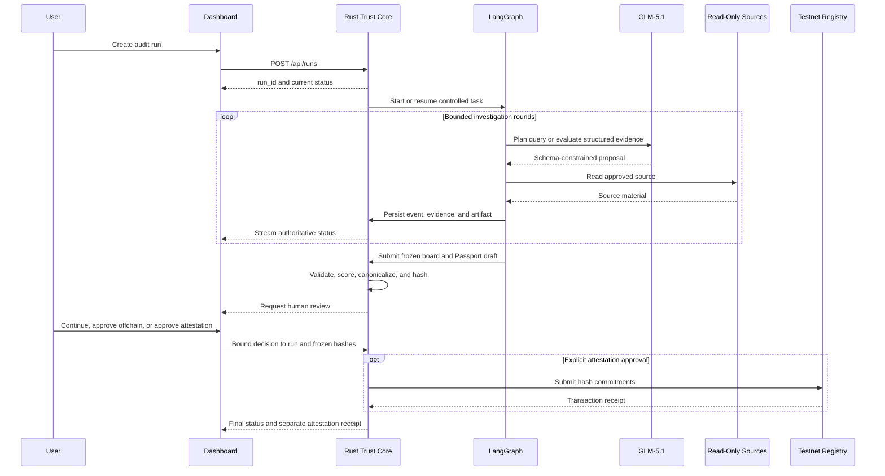
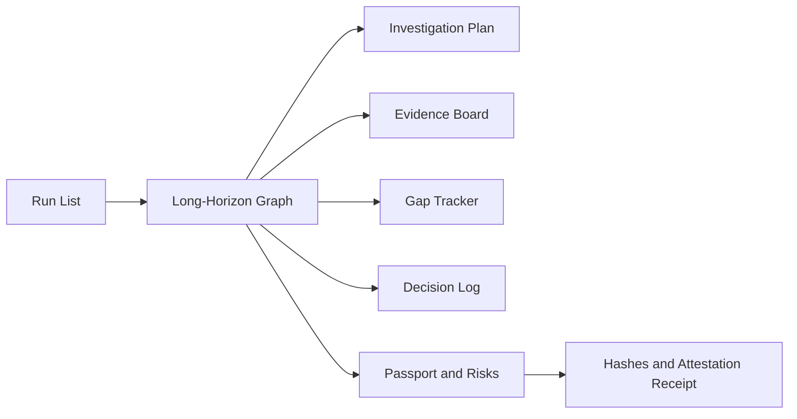

# AlethOS ToolPassport 技术设计

## 1. 文档状态与设计原则

本文同时描述当前实现基线和目标架构。为避免把计划能力误写成已经完成，使用以下状态：

| 标记 | 含义 |
| --- | --- |
| Implemented | 当前仓库已有实现和测试 |
| Partial | 已有基础实现，但尚未满足完整契约 |
| Target | 已确定的目标设计，仍需按迁移顺序实现 |
| Future | MVP 后再评估，不属于当前契约 |

截至 2026-06-12，机器可读权威仍是 `schemas/` 中的 v0.1 JSON Schema。本文新增的 Evidence Board、check-level 评分、决策事件和事件哈希链属于目标 v0.2 设计；在 schema、后端、orchestrator 和 Dashboard 完成协调迁移前，不得向 v0.1 API 发送这些未定义字段。

架构职责保持固定：

| 层 | 技术 | 唯一职责 |
| --- | --- | --- |
| Dashboard | Next.js、React、React Flow、TanStack Query | 展示后端状态并发起用户操作，不承载业务规则 |
| Trust Core | Rust、Axum、SQLx、SQLite、Alloy | API、持久化、append-only 事件、Artifact、确定性评分、最终 Hash、审批和链上写入 |
| Orchestrator | Python、LangGraph、Pydantic | 长程任务状态、节点调度、分支、预算、重试、恢复和人工等待 |
| Reasoning | GLM-5.1 | 在版本化标准内生成计划、查询、证据化判断、审查意见和报告草稿 |
| Research | 受控网页、GitHub 和用户材料读取器 | 只读发现和采集来源，不执行被审计项目 |
| Web3 | Solidity、Foundry | 保存最小 Hash commitment |
| Engineering | Codex | 开发期实现、测试和修复，不属于运行时信任链 |

Rust 是系统记录和确定性计算的唯一权威来源。LangGraph 不直接写数据库、计算最终 Hash 或提交交易；Dashboard 不直接调用 GLM、数据库或 RPC；GLM 输出必须 schema 校验后才能进入状态。任何签名、部署或链上写入都需要显式人工批准。

## 2. 信任声明与非目标

ToolPassport 的目标是可追溯、可复查、可验证和不可静默篡改，而不是证明报告语义绝对正确。

系统可以证明：

- 某个 Passport 与 Audit Log 在冻结后是否发生变化；
- 某个 claim、check、风险或评分理由引用了哪些证据；
- 审计使用了哪个标准、Profile、模型和工作流版本；
- 审计过程中发生了哪些节点、分支、重试和人工决定；
- 某个地址何时向 Registry 提交了指定 Hash。

系统不能单独证明：

- 来源网页、仓库声明或用户材料本身真实；
- GLM 的语义判断一定正确或完整；
- 未检查范围不存在风险；
- 链上提交地址代表某个现实主体，除非另有身份验证；
- 链上 Hash 对应的链下内容始终可获得。

报告和 Dashboard 必须展示这些边界。禁止使用“链上保证报告真实”之类表述。

## 3. Monorepo 与目标数据流

```text
.
├── AGENTS.md
├── README.md
├── .codex/work-guide.md
├── docs/
├── backend/
├── orchestrator/
├── dashboard/
├── contracts/
├── schemas/
├── examples/
├── scripts/
└── runs/
```

`runs/` 仅保存本地 Artifact，不是数据库替代。敏感材料、大体积快照和未授权内容默认不提交。跨模块共享类型以 `schemas/` 为机器可读权威；字段变更必须同时更新 schema、实现、测试和本文。



目标进程模型仍由 Rust 启动受控 Python orchestrator 子进程，并通过 `RUN_ID` 与 `BACKEND_URL` 关联。后续可以替换为独立服务，但不得改变 Rust 权威边界。

## 4. 标准、Profile 与 Check 模型

### 4.1 Audit Standard

`Audit Standard` 是版本化、只读的审计范式，定义维度、通用 controls、证据质量规则、评分聚合、风险门槛和停止条件。Agent 只能引用标准，不能在运行中修改标准或创建未版本化评分规则。

目标标准标识示例：

```json
{
  "standard_id": "alethos-toolpassport",
  "standard_version": "0.2.0",
  "dimensions": [
    "capability_clarity",
    "interface_openness",
    "automation_readiness",
    "data_portability",
    "permission_risk",
    "evidence_quality",
    "ecosystem_fit"
  ]
}
```

### 4.2 Tool Type Profile

Profile 将通用标准具体化为某类工具的检查路线。每个 Profile 必须声明版本、适用条件、检查项、权重、所需来源和高风险检查。MVP 目标 Profile 为 `mcp_server`、`agent_framework` 和 `cli_api_tool`；无法可靠识别时只能使用明确受限的 `generic` Profile。

Profile 选择规则：

1. `tool_fingerprint` 输出候选类型、证据和置信度；
2. 只有达到配置阈值时才自动选择专用 Profile；
3. 低置信度或类型冲突时使用 `generic`，或请求人工选择；
4. Profile 一旦进入调查回路便绑定到运行版本；切换 Profile 必须记录原因并重建计划；
5. Agent 不得因为“更容易得高分”而更换 Profile。

### 4.3 Check 与确定性评分

Check 是最小审计单元。Agent 负责提交证据化 finding；Rust 根据版本化规则计算得分。目标 Check 定义至少包含：

```json
{
  "check_id": "automation.structured_io",
  "profile_id": "agent_framework",
  "dimension": "automation_readiness",
  "question": "Does the tool expose stable structured input and output?",
  "weight": 1.2,
  "required_evidence_types": ["official_docs", "github_readme", "public_example"],
  "high_risk": false,
  "scoring_rule_id": "positive_capability_v1"
}
```

Finding 使用 `pass | partial | fail | unknown | not_applicable`。`unknown` 表示证据不足并计为零分；`not_applicable` 只能由 Profile 规则或人工决定，并必须有理由。Agent 不能直接提供 `total_score`、rating、最终 dimension score 或 Hash。

目标聚合规则为：

```text
dimension_score =
  floor(5 * sum(check_weight * rule_points) / sum(applicable_check_weight))

total_score = floor(average(dimension_scores) * 20)
```

`rule_points` 由 Rust 根据 `scoring_rule_id` 和 finding 计算，范围为 `0..1`。高风险检查可以触发 rating 上限或人工阻断，不能仅靠其他 checks 的分数抵消。v0.1 Passport 仍保存七个整数维度分数；check results 在完成 v0.2 schema 迁移前作为独立 Artifact，不写入 Passport v0.1。

## 5. 长程 Agent 状态机

长程 Agent 的核心不是自由文本推理，而是维护可恢复的结构化工作状态，并在有限预算内持续减少高价值不确定性。


### 5.1 节点契约与使用规则

所有节点必须有类型化输入和输出，在开始与结束时请求 Rust 追加事件，并把可复查结果保存为 Artifact。节点输出只包含决策摘要和结构化结果，不保存私有 chain-of-thought。失败必须产生可操作错误和明确路由。

| Node | 输入与职责 | 必须产出 | 使用规则与分支 |
| --- | --- | --- | --- |
| `intake_normalization` | 用户目标、工具标识、URL、本地材料引用和运行策略 | 规范化 Tool Intake、允许来源、预算和限制 | 拒绝空目标、非法 URL、未授权文件和主网请求；不读取 `.env` |
| `tool_fingerprint` | Tool Intake 和初始来源 | 候选工具类型、置信度和依据 | 不把用户声明当作唯一分类依据；无法判断时标记未知 |
| `profile_selector` | 候选类型和版本化 Profile catalog | 绑定的 Profile ID/version 或人工选择请求 | 不得临时创建 checks；Profile 切换必须生成事件并重建计划 |
| `audit_plan_builder` | 标准、Profile、目标、预算 | 分阶段计划、来源策略、优先级和停止条件 | 高风险 checks 优先；计划必须在预算内并允许恢复 |
| `hypothesis_builder` | Profile checks 和已知材料 | 待验证 claims、风险假设和初始 Gap Tracker | 假设必须对应 check 或明确审计目标，禁止无范围扩张 |
| `source_discovery` | 当前高优先级 gaps | 候选来源、查询目的和预期证据类型 | 优先官方与可定位来源；搜索摘要只能用于发现，不是最终证据 |
| `evidence_collection` | 已批准候选来源 | 原始 Evidence Artifact 请求 | 只读、限时、限大小、限制重定向；不得安装或执行目标项目 |
| `evidence_normalization` | 原始来源内容 | Evidence Manifest entry、摘录、来源元数据和去重结果 | Rust 生成 ID、内容 Hash 和 Artifact 路径；摘录需遵守版权与隐私边界 |
| `claim_evidence_mapping` | Evidence Board、checks、新证据 | 支持与反证关系、claim 状态和置信度建议 | 每个 finding 必须引用 evidence 或明确缺口；冲突证据不得删除 |
| `gap_analysis` | Evidence Board、Profile 和预算 | 按影响排序的 gaps、覆盖率和停止建议 | 优先高权重与高风险缺口；不得为低价值问题无限调研 |
| `next_query_planning` | gaps 和已尝试查询 | 下一轮查询计划或停止理由 | 必须避免无变化重复查询；重复失败升级为人工决定或有限结论 |
| `freeze_evidence_board` | 当前 Board、gaps 和范围 | 不可变 Board version 与冻结摘要 | 冻结后不能静默追加证据；继续调研创建新 Board version |
| `check_execution` | 冻结 Board 和 Profile rules | 每个 check 的 finding、理由和 evidence IDs | GLM 可提出 finding，Rust 验证结构并执行确定性评分 |
| `risk_register_builder` | Check findings 和权限 taxonomy | 风险、影响、缓解建议和人工检查项 | 文件、Shell、密钥、钱包、数据库写入和费用风险必须显式处理 |
| `counter_evidence_search` | 高分 claims、高风险项和冲突 | 反证查询与结果 | 每个高风险权限至少一轮；不得仅搜索支持性材料 |
| `consistency_review` | Board、findings、risk register 和草稿 | 无证据结论、冲突、遗漏和过度声明清单 | 发现问题时返回 mapping、checks 或 research，不直接掩盖问题 |
| `score_calibration` | Findings、review issues 和规则 | 校准后的 finding 建议与评分变更理由 | 评分仍由 Rust 计算；弱证据、高冲突和未知边界不得获得高分 |
| `passport_and_report_draft` | 冻结 Board、确定性分数和风险 | Passport draft 与 Markdown report | 报告只能引用已冻结数据，必须说明范围、缺口和非目标 |
| `schema_validation` | 结构化草稿和版本化 schema | 验证结果与字段级错误 | 验证失败不得进入 Hash；错误进入有限修复 |
| `repair_structured_output` | 验证错误和原始草稿 | 修复后的结构化草稿 | 最多两次；不得改变冻结证据或确定性分数 |
| `provenance_freeze` | 有效 Passport、Board、事件和版本 | `passportHash`、`auditLogHash` 和 provenance Artifact | 仅 Rust 可执行；冻结后修改必须生成新版本 |
| `human_review_gate` | 冻结 Hash、报告、缺口和风险 | 继续调研、链下批准、上链批准或拒绝 | 决定必须绑定 run、Board version、Hash、chain 和 contract |
| `attest_onchain` | 有效批准和冻结 commitment | 独立 Attestation Receipt | 仅 Rust 执行；禁止自动重发；失败回到人工决定 |

### 5.2 调查预算与停止条件

长程任务必须可控。运行策略至少包含最大调研轮数、最大来源数、单来源大小、单请求超时、结构修复次数和可选付费 API 预算。MVP 默认最多三轮调查，结构修复最多两次；配置变更必须记录在 Run。

满足以下条件时可以正常冻结：

- 所有高权重 checks 已有 `pass`、`partial`、`fail` 或经批准的 `not_applicable`；
- 每个高风险权限项已完成至少一轮反证检查；
- 所有评分理由都绑定 Evidence ID；
- 未解决 gaps 低于配置阈值，或不再可能在允许来源和预算内解决；
- consistency review 不存在阻断问题。

达到轮数、来源数或费用上限时必须停止自动调研。此时系统生成 `insufficient_evidence` 有限结论，或进入 `human_research_gate`。Agent 不得绕过预算，也不得通过重复改写查询伪装取得进展。

### 5.3 固定角色而非自由多 Agent

MVP 可以把节点组织为固定角色：Planner、Researcher、Evidence Analyst 和 Skeptic Reviewer。角色只是一组受主图约束的提示模板和工具权限，不是自由通信的 Agent 网络。所有角色共享同一个权威 Graph State，并通过 Rust API 持久化结果。

## 6. Graph State、恢复与副作用

目标 Graph State 示例：

```json
{
  "run_id": "uuid",
  "goal": "string",
  "tool": {
    "name": "string",
    "type_candidates": [],
    "urls": []
  },
  "standard_version": "0.2.0",
  "profile_id": "agent_framework",
  "profile_version": "0.2.0",
  "phase": "investigation",
  "current_node": "gap_analysis",
  "research_round": 2,
  "research_budget": {
    "max_rounds": 3,
    "max_sources": 30,
    "sources_used": 14
  },
  "evidence_board_version": 1,
  "evidence_ids": [],
  "artifact_ids": [],
  "open_gap_ids": [],
  "review_issue_ids": [],
  "errors": [],
  "approval_status": "not_requested"
}
```

Graph State 是 orchestrator 的编排状态，不是系统记录的替代品。重要事件、Evidence、Artifact、冻结版本、审批和最终 Hash 必须先写入 Rust。LangGraph checkpoint 用于恢复调度；Rust 数据用于恢复权威业务状态。

恢复规则：

- 每个节点应可重入，外部写操作使用由 Rust 验证的 idempotency key；
- 调研读取可以按策略重试，写入 Artifact、审批或链上操作不得盲目重试；
- 节点在确认 Rust 已持久化结束事件后才进入下一节点；
- 进程中断后，从最近 checkpoint 和 Rust 权威状态重建；
- 如果 checkpoint 与 Rust 状态冲突，以 Rust 为准并生成恢复事件；
- 用户取消后禁止启动新副作用，但已完成事件保持 append-only。

## 7. Evidence Workspace

长程任务不能把全部原始内容反复塞入模型上下文。系统使用结构化 Evidence Workspace 管理原始来源、规范化证据和工作产物。

```text
runs/<run_id>/
├── evidence/raw/
├── evidence/normalized/
├── working/
│   ├── audit-plan.json
│   ├── hypotheses.json
│   ├── evidence-board.json
│   ├── gap-tracker.json
│   ├── risk-register.json
│   └── check-results.json
└── final/
    ├── passport.json
    ├── report.md
    ├── audit-provenance.json
    └── attestation-receipt.json
```

Artifact 路径由 Rust 生成并限制在配置根目录内，禁止路径穿越。模型只接收完成当前节点所需的摘要和 Evidence ID；需要原文时通过受控读取器按 ID 取回。

目标 Evidence Manifest entry：

```json
{
  "evidence_id": "uuid",
  "source_type": "official_docs",
  "source_url": "https://example.com/docs",
  "source_revision": "optional commit or version",
  "title": "Interface documentation",
  "excerpt": "Short reviewable excerpt or summary",
  "retrieved_at": "RFC3339 timestamp",
  "content_hash": "0x-prefixed sha256",
  "snapshot_artifact_id": "uuid",
  "supports": ["claim_id", "check_id"],
  "contradicts": [],
  "metadata": {}
}
```

`content_hash` 证明系统保存或读取的字节未被静默修改，不证明内容真实。快照是否保存由授权、版权、隐私和大小策略决定；不能保存快照时，仍记录 URL、时间、可用 revision 和受限摘要。

## 8. Run Events、决策记录与 Provenance

### 8.1 当前 v0.1 事件

当前 schema 支持：

```text
run_created
run_status_changed
node_started
node_finished
artifact_created
evidence_created
approval_required
approval_resolved
attestation_submitted
attestation_confirmed
error
```

SQLite 已使用 `sequence` 排序，并通过 trigger 禁止更新和删除。当前 API 响应和 v0.1 schema 不公开 `sequence`，也没有事件 Hash。

Rust 在创建 Run 的同一事务中追加首个 `run_created` 事件。v0.1 事件追加还会原子更新 Run 摘要，并使用保守状态规则：

- `node_started` 允许 `pending -> running`，或在 `running` 中推进 `current_node`；
- `node_finished` 只允许在 `running` 中更新 `current_node`；
- `approval_required` 允许 `running -> waiting_approval`；
- `approval_resolved` 允许 `waiting_approval -> running`；
- `run_status_changed` 的 `payload.status` 只能是 `success` 或 `failed`；允许的终止迁移为 `pending -> failed`、`running -> success | failed` 和 `waiting_approval -> failed`；
- `run_created` 只能由 Rust 生成，`cancelled` 保留给计划中的取消 API；
- 事件追加和 Run 摘要投影位于同一事务；并发状态发生变化时返回 `run_state_conflict`。

### 8.2 目标 v0.2 决策事件

长程任务需要记录分支理由，而不仅是节点开始和结束。目标事件将增加：

```text
profile_selected
hypothesis_created
hypothesis_updated
research_query_planned
gap_detected
evidence_linked
claim_contradicted
evidence_board_frozen
review_issue_found
score_changed
human_feedback_received
provenance_frozen
```

事件 payload 必须是结构化决策摘要，不记录私有 chain-of-thought。所有事件类型加入 v0.2 前，必须协调更新 schema、Rust enum、migration、orchestrator 和 Dashboard。

### 8.3 目标事件哈希链

仅有 append-only 数据库 trigger 可以阻止正常 API 修改，但不能独立证明数据库管理员未重写历史。目标 v0.2 由 Rust 在追加事件时分配 `sequence`，并计算：

```text
event_hash = SHA-256(JCS(event_without_event_hash))
```

`event_without_event_hash` 包含 `run_id`、`sequence`、`node_id`、`event_type`、`payload`、`created_at` 和 `prev_event_hash`。首个事件的 `prev_event_hash` 为固定零值。任何插入、删除、替换或重排都会改变后续链。

`auditLogHash` 定义为 `provenance_frozen` 事件的 `event_hash`，只承诺冻结边界前的审计过程。该事件 payload 可以包含 `passportHash` 和冻结版本，但不得包含尚未计算的 `auditLogHash`；Rust 在追加事件后把得到的 `event_hash` 作为 `auditLogHash` 返回。审批和链上回执发生在冻结之后，保留在 append-only Run Log 中，但不改变已批准的 `auditLogHash`。如果用户要求继续调研，系统创建新的 Evidence Board 和 provenance version，并计算新的 Hash。

## 9. Passport、Hash 与 Attestation

### 9.1 Passport 不可变边界

Passport 包含工具身份、审计范围、标准与 Profile 版本、能力 claims、接口、Evidence 引用、分数、风险、建议和已知缺口。每个能力、风险和评分理由必须引用 Evidence ID 或明确标记 `not_checked` / `unknown`。

当前 v0.1 schema 要求 `web3_attestation` 对象，但 attestation 发生在 Passport 冻结之后。为避免循环依赖和冻结后修改，v0.1 实现必须把该字段冻结为不变的预提交描述或空对象，交易回执只保存在独立数据库记录和 Artifact 中。目标 v0.2 将把 Attestation Receipt 从 Passport schema 中正式分离。

### 9.2 规范化与 Hash

Rust 在 Hash 前执行：

1. schema 校验并拒绝未知字段；
2. 校验所有引用、标准版本和冻结版本；
3. 计算 check、dimension、total score 和 rating；
4. 按 RFC 8785 JCS 生成规范化 UTF-8 JSON；
5. 使用 SHA-256 生成 `passportHash`；
6. 追加包含 `passportHash` 的 `provenance_frozen` 事件，并把事件链头作为 `auditLogHash`；
7. 保存不可变 Artifact 和两个 Hash 的关联元数据。

为避免循环 commitment，Passport 可以引用 `run_id` 和 provenance version，但不得包含尚未计算的 `auditLogHash`；`provenance_frozen` 事件也不得包含自身的 `auditLogHash`。相同规范化产物必须生成相同 `passportHash`。冻结后修改报告、证据引用或分数需要新 Passport version 和新 Hash。

### 9.3 Human Review 与链上提交

人工决定至少绑定：

```json
{
  "run_id": "uuid",
  "evidence_board_version": 1,
  "passport_hash": "0x...",
  "audit_log_hash": "0x...",
  "decision": "approve_attestation",
  "chain_id": 11155111,
  "registry_contract": "0x..."
}
```

`approve_without_chain` 表示用户接受链下冻结结果，不触发签名或交易。`approve_attestation` 只授权指定 commitment、chain 和 contract 的一次提交。失败交易不得自动重发。

Registry 保持最小接口：

```solidity
recordPassport(
    string toolId,
    string toolType,
    bytes32 passportHash,
    bytes32 auditLogHash
)
```

合约中的 `auditor` 是 `msg.sender`，不等同于完成审阅的用户身份。MVP 的人工批准记录保存在 Rust；EIP-712 用户签名、ERC-1271、系统签名和 EAS 兼容属于 Future。

## 10. Rust Trust Core

### 10.1 模块边界

```text
api/          Axum handlers，只做协议转换和鉴权
domain/       Run、Evidence、Check、Passport、Artifact、Approval、Attestation
services/     状态迁移、评分、Hash、冻结、审批和 attestation 规则
repository/   SQLx 持久化
events/       append-only 事件、哈希链和 SSE
artifacts/    文件写入、读取、Hash 和路径隔离
web3/         Alloy client 和 Registry 调用
```

### 10.2 API 路线图

| 状态 | 方法与路径 | 行为 |
| --- | --- | --- |
| Implemented | `POST /api/runs` | 原子创建 pending Run 和首个 `run_created` 事件；当前尚不启动 orchestrator |
| Implemented | `GET /api/runs` | 返回 Run 列表 |
| Implemented | `GET /api/runs/:run_id` | 返回 Run 和当前事件列表 |
| Implemented | `POST /api/runs/:run_id/events` | 追加 v0.1 事件，并原子投影已验证的 Run 状态和当前节点 |
| Target | `POST /api/runs/:run_id/cancel` | 请求取消任务 |
| Target | `GET /api/runs/:run_id/events` | SSE 事件流 |
| Target | `POST /api/runs/:run_id/evidence` | 保存并 Hash Evidence |
| Target | `POST /api/runs/:run_id/artifacts` | 保存中间或最终 Artifact |
| Target | `POST /api/runs/:run_id/check-results` | 验证 finding 并计算分数 |
| Target | `POST /api/runs/:run_id/freeze` | 冻结 Board、provenance 和 Passport |
| Target | `GET /api/passports/:passport_id` | 返回不可变 Passport |
| Target | `POST /api/runs/:run_id/approval` | 保存绑定 Hash 的人工决定 |
| Target | `POST /api/runs/:run_id/attest` | 在有效批准后提交测试网交易 |

所有响应使用 JSON，SSE 除外。错误响应至少包含稳定 `code`、可读 `message` 和结构化 `details`。

### 10.3 SQLite 路线图

当前已实现 `runs` 和 `run_events`。目标表包括：

```text
runs
run_events
evidence
artifacts
evidence_boards
check_results
passports
approvals
attestations
```

事件、Evidence、Board、Check Result 和 Artifact 关联 `run_id`。事件只追加；冻结 Board 和 Passport 不允许原地修改；secrets 不进入任何表；migration 由 SQLx 管理。

## 11. Dashboard

Dashboard 只显示 Rust 返回的权威状态，不重算分数、Hash 或审批有效性。目标 workspace 使用以下视图共同展示长程任务，而不是只展示最终报告：



Investigation Plan 展示 Profile、阶段、预算和当前查询目标；Evidence Board 展示 claim/check 到支持与反证的映射；Gap Tracker 展示为何继续或停止；Decision Log 展示 Profile 选择、分支、降分、反证和人工反馈。UI 不显示或声称展示模型私有思维过程。

人工操作必须清楚区分“继续调研”“批准链下结果”“批准测试网 attestation”和“拒绝”。上链批准页面必须显示绑定的两个 Hash、chain ID 和 Registry 地址。

## 12. 安全与外部访问边界

```yaml
permissions:
  network_read: allow_for_research_with_ssrf_controls
  local_file_read: user_provided_or_workspace_only
  local_file_write: rust_managed_artifact_root_only
  shell_execution: deny_for_audited_tools
  wallet_sign: human_approval_required
  contract_deploy: human_approval_required
  mainnet: deny
  paid_api: explicit_budget_required
  secrets_access: runtime_env_only_never_artifact
```

URL loader 必须限制协议、域名策略、响应大小、超时和重定向，并阻止访问本机、内网和云 metadata 地址。日志、事件、Evidence 和 Artifact 必须脱敏。orchestrator 子进程只获得必要环境变量。外部内容视为不可信数据，不能改变系统指令、Profile、预算或工具权限。

以下操作始终标记 `[HUMAN REQUIRED]`：提供 credentials；授权付费服务；选择有争议的审计政策；批准不受信来源；签名；部署；链上写入；以及决定是否接受证据不足的高风险结论。

## 13. 当前实现冲突与迁移计划

### 13.1 对照结果

| 区域 | 当前实现 | 与目标设计的关系 |
| --- | --- | --- |
| Rust Run API | 已实现创建、列表、详情和事件追加 | Compatible foundation；创建 Run 会原子追加 `run_created`，事件追加会投影已验证的 `status/current_node`，但仍不会启动 orchestrator |
| Append-only Event | SQLite sequence、更新/删除 trigger 已实现 | Partial；尚无公开 sequence、决策事件、`prev_event_hash` 或 `event_hash` |
| Orchestrator | TypedDict mock，仅 `clarify_goal -> plan_audit` | Major planned gap；尚无 Pydantic、事件发射、调查回路、恢复、预算或人工等待 |
| Evidence / Artifact | 只有 v0.1 schema，无 API 和表 | Planned gap；Evidence Hash、snapshot、Board 和 Gap Tracker 需要 schema/API migration |
| Passport 与评分 | v0.1 schema 允许七维分数，字段约束较松 | Conflict to resolve；目标 check-level 评分和 Rust 聚合尚未实现 |
| `web3_attestation` | v0.1 Passport 必填对象 | Design conflict；回执若写回会改变已冻结 Passport，必须独立存储并在 v0.2 分离 |
| Audit Log Hash | 文档曾按时间与 event ID 排序 | Conflict to resolve；数据库已有更可靠 sequence，目标应按 sequence 建哈希链 |
| Dashboard | 仅开发 workspace scaffold | Planned gap；尚无 API、SSE、Graph、Board、Gap、Decision 或 approval UI |
| Registry | 最小 commitment 合约和 Foundry tests 已实现 | Compatible；继续只存两个 Hash、auditor 和 timestamp |
| README | 已准确标记当前未实现能力 | Compatible；实现每个迁移阶段后继续同步 |

### 13.2 分阶段迁移

迁移必须保持 mock 路径可运行，并避免一次跨所有模块修改未完成契约。

1. **Standard and Profile artifacts**：新增版本化标准、三个 MVP Profile 和 check fixtures；暂不改变 Passport v0.1。
2. **Orchestrator investigation mock**：用 fixture 实现类型化调查回路、Board、Gap、停止条件和 Skeptic Review；Artifact 先通过受控本地 mock，随后接后端。
3. **Evidence and Artifact trust core**：扩展 schema、migration 和 API，由 Rust 分配 ID、保存内容并计算 Hash。
4. **Decision events and hash chain**：发布 run-event v0.2，加入 sequence、决策事件和事件哈希链；迁移所有消费者。
5. **Deterministic checks and Passport v0.2**：Rust 实现 check 规则、评分聚合、JCS Hash，并把 Attestation Receipt 从 Passport 分离。
6. **SSE, recovery, and Dashboard**：接入 checkpoint、恢复、实时 Graph、Evidence Board、Gap Tracker 和 Decision Log。
7. **Human gate and testnet attestation**：实现绑定 Hash 的审批和独立回执；任何真实提交仍需人工批准。

每个阶段必须更新本文、schema、实现和测试，并运行 `scripts/check_all.sh`。在某阶段完成前，不得把其目标能力标记为 Implemented。

## 14. 测试与验收

Backend 重点验证状态迁移、append-only 和哈希链、Evidence/Artifact Hash、路径隔离、确定性评分、JCS Hash、冻结边界、审批绑定和 mock RPC。Orchestrator 重点验证每个节点契约、Profile 分支、调查预算、无变化检测、反证检查、有限修复、恢复和人工等待。Dashboard 重点验证实时状态、Board/Gap/Decision 映射、失败与空状态，以及人工批准参数。Contracts 继续验证最小 commitment、event 和多版本记录。

端到端 mock 验收必须展示：Profile 选择；至少两轮有理由的调查；一个 gap 触发的查询；一条支持或反证映射；一次 review 导致的 finding 或评分变化；冻结后的稳定 Hash；以及链下批准路径。测试网 attestation 只在人工批准后单独验收。

统一检查入口：

```bash
scripts/check_backend.sh
scripts/check_orchestrator.sh
scripts/check_dashboard.sh
scripts/check_contracts.sh
scripts/check_schemas.sh
scripts/check_docs.sh
scripts/check_all.sh
```

## 15. 环境变量

```env
APP_ENV=development
BACKEND_HOST=127.0.0.1
BACKEND_PORT=8080
DATABASE_URL=sqlite://data/toolpassport.db
ARTIFACT_ROOT=./runs

ORCHESTRATOR_COMMAND=python
ORCHESTRATOR_BACKEND_URL=http://127.0.0.1:8080

ZAI_API_KEY=
ZAI_BASE_URL=https://api.z.ai/api/paas/v4
ZAI_MODEL=glm-5.1

CHAIN_ID=
RPC_URL=
PRIVATE_KEY=
REGISTRY_CONTRACT=

NEXT_PUBLIC_BACKEND_URL=http://127.0.0.1:8080
```

Agent 不读取、修改或打印 `.env`，仓库也不提交该文件。运行时只能从受控进程环境接收必要配置，前端公开变量不得包含密钥。真实模型、付费 API、钱包和测试网配置均需要人工提供与授权。

## 16. 权威参考与采用边界

- [OpenSSF Scorecard](https://scorecard.dev/) 证明了以自动化 checks、风险权重和修复建议组织评估的可行性；ToolPassport 借鉴 check-level 结构，但使用自己的 AI Tool 标准。
- [SLSA Provenance](https://slsa.dev/spec/v1.2/provenance) 将 provenance 定义为可追踪产物来源、时间和生成过程的可验证信息；ToolPassport 将该思想用于审计产物，不宣称 SLSA 合规。
- [in-toto Attestation Framework](https://github.com/in-toto/attestation) 提供关于软件生成过程的可验证声明格式；步骤级 attestation 属于 Future，MVP 先实现内部 provenance。
- [RFC 8785 JCS](https://www.rfc-editor.org/rfc/rfc8785) 用确定性属性排序和 I-JSON 约束生成可哈希 JSON；Rust 最终 Hash 目标采用该规范。
- [Sigstore Rekor](https://docs.sigstore.dev/logging/overview/) 展示了 append-only 透明日志、inclusion proof 和可查询登记；MVP Registry 只是最小链上 commitment，不提供 Rekor 等价保证。
- [NIST OSCAL](https://pages.nist.gov/OSCAL/) 展示了 machine-readable controls、assessment plan 和 assessment results 的分层；ToolPassport 的 Standard/Profile/Check 模型借鉴其思想，不宣称 OSCAL 兼容。
- [LangGraph Persistence](https://docs.langchain.com/oss/python/langgraph/persistence) 为 checkpoint、线程状态和恢复提供实现参考；权威业务状态仍保存在 Rust。
